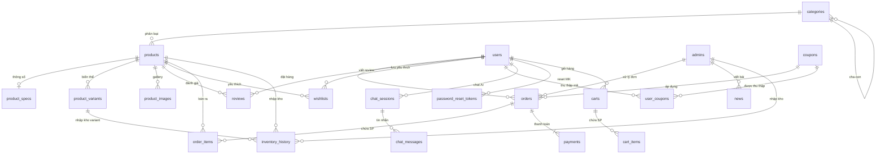

# Database Design — Đèn Hoa Mỹ E-Commerce

> **RDBMS:** MySQL 8.0  
> **Charset:** utf8mb4 (hỗ trợ tiếng Việt đầy đủ)  
> **Tổng:** 21 bảng · 60+ sản phẩm seed data  
> **Cập nhật:** 06/06/2026

---

## Tổng Quan

### Nhóm bảng theo chức năng

```
┌─────────────────────────────────────────────────────────────┐
│                    DATABASE: denhoamy_db                     │
├─────────────────────────────────────────────────────────────┤
│                                                             │
│  📦 SẢN PHẨM (5 bảng)                                      │
│  ├── products          ← Sản phẩm chính                    │
│  ├── product_specs     ← Thông số kỹ thuật (1:1)           │
│  ├── product_variants  ← Biến thể: kích thước, ánh sáng    │
│  ├── product_images    ← Gallery ảnh sản phẩm              │
│  └── categories        ← Danh mục (cây phân cấp)           │
│                                                             │
│  🛒 THƯƠNG MẠI (6 bảng)                                    │
│  ├── orders            ← Đơn hàng                          │
│  ├── order_items       ← Chi tiết đơn (sản phẩm x số lượng)│
│  ├── payments          ← Thanh toán (COD/Bank/PayOS)        │
│  ├── coupons           ← Mã giảm giá                       │
│  ├── user_coupons      ← Ví voucher khách hàng             │
│  └── carts / cart_items← Giỏ hàng persistent               │
│                                                             │
│  👤 NGƯỜI DÙNG (3 bảng)                                    │
│  ├── users             ← Khách hàng                        │
│  ├── admins            ← Quản trị viên (admin/staff)       │
│  └── password_reset_tokens ← Magic link quên mật khẩu      │
│                                                             │
│  💬 TƯƠNG TÁC (5 bảng)                                     │
│  ├── reviews           ← Đánh giá sản phẩm                 │
│  ├── wishlists         ← Sản phẩm yêu thích                │
│  ├── chat_sessions     ← Phiên chat AI                     │
│  ├── chat_messages     ← Tin nhắn trong phiên              │
│  └── news              ← Tin tức / Blog                    │
│                                                             │
│  ⚙️ HỆ THỐNG (2 bảng)                                     │
│  ├── settings          ← Cấu hình website (Key-Value)      │
│  └── inventory_history ← Lịch sử nhập/xuất kho             │
│                                                             │
└─────────────────────────────────────────────────────────────┘
```

---

## Entity Relationship Diagram (ERD)



---

## Chi Tiết Từng Bảng

### 1. `products` — Sản phẩm

| Cột | Kiểu | Ràng buộc | Mô tả |
|---|---|---|---|
| `id` | INT | PK, AUTO_INCREMENT | ID sản phẩm |
| `category_id` | INT | FK → categories.id, NULL | Danh mục |
| `ten_san_pham` | VARCHAR(255) | | Tên sản phẩm |
| `ma_san_pham` | VARCHAR(100) | UNIQUE | Mã SP (DC04305, DT03308...) |
| `loai_den` | VARCHAR(100) | | Loại: Đèn chùm, Đèn thả, Đèn ốp trần... |
| `phong_cach` | VARCHAR(100) | | Phong cách (inline spec) |
| `khong_gian_lap_dat` | VARCHAR(255) | | Không gian lắp đặt (inline spec) |
| `bong_den` | VARCHAR(255) | | Bóng đèn (inline spec) |
| `dien_ap` | VARCHAR(50) | | Điện áp (inline spec) |
| `chat_lieu` | VARCHAR(255) | | Chất liệu (inline spec) |
| `tinh_trang` | VARCHAR(50) | | Tình trạng (inline spec) |
| `tuoi_tho` | VARCHAR(50) | | Tuổi thọ (inline spec) |
| `kich_thuoc` | VARCHAR(255) | | Kích thước (inline spec) |
| `price` | DECIMAL(15,2) | NOT NULL | Giá bán (VNĐ) |
| `old_price` | DECIMAL(15,2) | DEFAULT 0 | Giá gốc (gạch); chỉ hiển thị khi **> `price`**; `0` = không gạch (tùy chọn khi nhập SP) |
| `cost_price` | DECIMAL(15,0) | DEFAULT 0 | Giá nhập (tính lợi nhuận) |
| `is_hot_deal` | TINYINT(1) | DEFAULT 0 | Đánh dấu Hot Deal |
| `price_before_hot_deal` | DECIMAL(15,2) | NULL | Giá bán snapshot trước Hot Deal (khôi phục khi gỡ) |
| `old_price_before_hot_deal` | DECIMAL(15,2) | NULL | `old_price` snapshot trước Hot Deal |
| `stock` | INT | DEFAULT 15 | Tồn kho |
| `description` | LONGTEXT | | Mô tả chi tiết |
| `image_url` | LONGTEXT | | Ảnh chính |
| `gallery` | LONGTEXT | NULL | JSON mảng ảnh phụ (legacy) |
| `created_at` | TIMESTAMP | DEFAULT NOW() | Ngày tạo |

> **Soft Delete:** `deleted_at TIMESTAMP NULL` (thêm qua migration `migrate_index_softdelete.sql`)

**Indexes:** `ma_san_pham` (UNIQUE)  
**FK:** `category_id` → `categories(id)` ON DELETE SET NULL

---

### 2. `product_specs` — Thông số kỹ thuật

| Cột | Kiểu | Mô tả |
|---|---|---|
| `product_id` | INT | PK, FK → products.id |
| `phong_cach` | VARCHAR(100) | Hiện đại, Tân cổ điển, Mỹ, Nhật... |
| `khong_gian_lap_dat` | VARCHAR(255) | Phòng khách, phòng ngủ... |
| `bong_den` | VARCHAR(255) | Led (vàng, trung tính, trắng) |
| `dien_ap` | VARCHAR(50) | 220v |
| `chat_lieu` | VARCHAR(255) | Hợp kim + pha lê, Đồng + thủy tinh... |
| `tinh_trang` | VARCHAR(50) | Mới 100% |
| `tuoi_tho` | VARCHAR(50) | 50000 (giờ) |
| `kich_thuoc` | VARCHAR(255) | Kích thước SP |

**Quan hệ:** 1 Product ↔ 1 Spec (1:1)

---

### 3. `product_variants` — Biến thể sản phẩm

| Cột | Kiểu | Mô tả |
|---|---|---|
| `id` | INT | PK |
| `product_id` | INT | FK → products.id |
| `kich_thuoc` | VARCHAR(100) | VD: 60cm, 80cm |
| `anh_sang` | VARCHAR(100) | VD: Vàng, Trắng, Trung tính |
| `price` | DECIMAL(15,2) | Giá biến thể |
| `price_before_hot_deal` | DECIMAL(15,2) | NULL | Giá bán biến thể snapshot trước Hot Deal |
| `cost_price` | DECIMAL(15,0) | Giá nhập biến thể |
| `stock` | INT | Tồn kho riêng |
| `created_at` | TIMESTAMP | Ngày tạo |

**Quan hệ:** 1 Product ↔ N Variants (1:N)

---

### 4. `product_images` — Gallery ảnh

| Cột | Kiểu | Mô tả |
|---|---|---|
| `id` | INT | PK |
| `product_id` | INT | FK → products.id |
| `image_url` | LONGTEXT | URL ảnh |
| `is_main` | BOOLEAN | Ảnh chính? |
| `sort_order` | INT | Thứ tự hiển thị |
| `created_at` | TIMESTAMP | Ngày thêm |

---

### 5. `categories` — Danh mục (cây phân cấp)

| Cột | Kiểu | Mô tả |
|---|---|---|
| `id` | INT | PK |
| `name` | VARCHAR(255) | Tên danh mục |
| `parent_id` | INT | FK → categories.id (self-ref), NULL = root |
| `sort_order` | INT | Thứ tự sắp xếp |
| `created_at` | TIMESTAMP | Ngày tạo |

**Cấu trúc cây:**
```
Đèn chùm (parent)
├── Đèn chùm hiện đại
├── Đèn chùm tân cổ điển
└── Đèn chùm pha lê
Đèn thả (parent)
├── Đèn thả hiện đại
└── Đèn thả Nhật
```

---

### 6. `users` — Khách hàng

| Cột | Kiểu | Mô tả |
|---|---|---|
| `id` | INT | PK |
| `username` | VARCHAR(100) | UNIQUE, = SĐT khi đăng ký |
| `password` | VARCHAR(255) | bcrypt hash |
| `name` | VARCHAR(255) | Họ tên |
| `phone` | VARCHAR(20) | Số điện thoại |
| `email` | VARCHAR(255) | Email |
| `address` | TEXT | Địa chỉ profile / giao hàng (nullable) |
| `is_locked` | BOOLEAN | TRUE = tài khoản bị khóa |
| `created_at` | TIMESTAMP | Ngày đăng ký |

---

### 7. `admins` — Quản trị viên

| Cột | Kiểu | Mô tả |
|---|---|---|
| `id` | INT | PK |
| `username` | VARCHAR(100) | UNIQUE |
| `role` | ENUM('admin','staff') | Phân quyền cấp cao |
| `password` | VARCHAR(255) | bcrypt hash |
| `name` | VARCHAR(255) | Họ tên |
| `phone` | VARCHAR(20) | SĐT |
| `email` | VARCHAR(255) | Email |
| `avatar_url` | LONGTEXT | Ảnh đại diện |
| `permissions` | JSON | Phân quyền chi tiết cho staff |
| `is_active` | BOOLEAN | Trạng thái hoạt động |
| `created_at` | TIMESTAMP | Ngày tạo |

**Permissions JSON (Staff):**

Chỉ áp dụng khi `role = 'staff'`. Admin (`role = 'admin'`) để `permissions = NULL` — API/JWT coi là toàn quyền.

```json
{
  "dashboard": true,
  "categories": true,
  "products": true,
  "orders": true,
  "reviews": true,
  "customers": false,
  "coupons": true,
  "news": true,
  "policy": true,
  "accounts": false,
  "settings": false
}
```

| Key | Map API `users.php` |
|-----|---------------------|
| `customers` | GET/PUT khóa khách (`scope=customers`, `target=customer`) |
| `accounts` | GET admin, POST staff, PUT vô hiệu/sửa thông tin admin |
| *(role admin)* | POST admin, PUT role/permissions/password, DELETE admin |

**phpMyAdmin / DB cũ:** chạy [`mysql/migrate_user_rbac.sql`](../mysql/migrate_user_rbac.sql) nếu thiếu cột `role`, `permissions`, `is_active` hoặc `users.is_locked`, `users.address`.

**API admin:** RBAC chi tiết qua [`denhoamy_api/lib/admin_route_guard.php`](../denhoamy_api/lib/admin_route_guard.php) — map file/method → permission key; `settings` + `statistics` enforce trực tiếp.

**`users` vs `admins`:** Khách đăng ký → bảng `users` (khóa bằng `is_locked`). Nhân viên/quản trị → bảng `admins` (khóa bằng `is_active`). Không trộn hai bảng.

---

### 8. `orders` — Đơn hàng

| Cột | Kiểu | Mô tả |
|---|---|---|
| `id` | INT | PK |
| `user_id` | INT | FK → users.id, NULL nếu guest |
| `customer_name` | VARCHAR(255) | Tên khách |
| `phone` | VARCHAR(20) | SĐT |
| `email` | VARCHAR(255) | Email |
| `address` | TEXT | Địa chỉ giao hàng |
| `note` | TEXT | Ghi chú |
| `payment_method` | VARCHAR(50) | `cod`, `bank_transfer`, `payos`, `pay_at_store` |
| `delivery_method` | ENUM | `home` (giao tận nơi), `store` (nhận tại cửa hàng) |
| `total` | DECIMAL(15,0) | Tổng tiền |
| `coupon_code` | VARCHAR(50) | Mã giảm giá đã dùng |
| `coupon_id` | INT | FK → coupons.id (tham chiếu trực tiếp) |
| `discount_amount` | DECIMAL(15,0) | Số tiền giảm |
| `status` | ENUM | `pending` → `approved` → `shipping` → `completed` / `cancelled` |
| `processed_by` | INT | FK → admins.id (admin xử lý) |
| `created_at` | TIMESTAMP | Ngày tạo |
| `updated_at` | TIMESTAMP | Tự cập nhật khi thay đổi (ON UPDATE CURRENT_TIMESTAMP) |
| `deleted_at` | TIMESTAMP | Soft Delete (thêm qua migration) |

**Luồng trạng thái đơn hàng:**
```
pending ──→ approved ──→ shipping ──→ completed
   │            │            │
   └────────────┴────────────┘
                │
          → cancelled (hoàn kho + hoàn coupon)
```

**FK:**
- `user_id` → `users(id)` ON DELETE SET NULL
- `coupon_id` → `coupons(id)` ON DELETE SET NULL
- `processed_by` → `admins(id)` ON DELETE SET NULL

---

### 9. `order_items` — Chi tiết đơn hàng

| Cột | Kiểu | Mô tả |
|---|---|---|
| `id` | INT | PK |
| `order_id` | INT | FK → orders.id |
| `product_id` | INT | FK → products.id |
| `variant_id` | INT | FK → product_variants.id, NULL |
| `product_name` | VARCHAR(255) | Tên SP tại thời điểm mua (snapshot) |
| `quantity` | INT | Số lượng |
| `price` | DECIMAL(15,0) | Giá bán tại thời điểm mua |
| `cost_price` | DECIMAL(15,0) | Giá nhập tại thời điểm mua |

> **Lưu ý:** `price` và `cost_price` được **snapshot** khi tạo đơn — không bị ảnh hưởng nếu giá SP thay đổi sau này.

---

### 10. `payments` — Thanh toán

| Cột | Kiểu | Mô tả |
|---|---|---|
| `id` | INT | PK |
| `order_id` | INT | FK → orders.id |
| `payment_code` | VARCHAR(255) | Mã giao dịch (PayOS reference) |
| `amount` | DECIMAL(15,0) | Số tiền |
| `method` | ENUM | `cod`, `bank_transfer`, `momo`, `vnpay`, `payos`, `pay_at_store` |
| `status` | ENUM | `pending`, `completed`, `failed`, `refunded` |
| `evidence_url` | LONGTEXT | Ảnh bằng chứng chuyển khoản |
| `created_at` | TIMESTAMP | Ngày tạo |

---

### 11. `coupons` — Mã giảm giá

| Cột | Kiểu | Mô tả |
|---|---|---|
| `id` | INT | PK |
| `code` | VARCHAR(50) | UNIQUE, viết hoa |
| `discount_percent` | INT | Giảm theo % |
| `discount_amount` | DECIMAL(15,0) | Giảm số tiền cố định |
| `max_discount_amount` | DECIMAL(15,0) | Trần giảm khi dùng % (NULL = không giới hạn) |
| `min_order_value` | DECIMAL(15,0) | Giá trị đơn tối thiểu |
| `usage_limit` | INT | Giới hạn lượt dùng (NULL = không giới hạn) |
| `used_count` | INT | Đã dùng |
| `start_date` | DATE | Ngày bắt đầu |
| `end_date` | DATE | Ngày kết thúc |
| `is_active` | BOOLEAN | Trạng thái kích hoạt |
| `created_at` | TIMESTAMP | Ngày tạo |

---

### 12. `user_coupons` — Ví voucher

| Cột | Kiểu | Mô tả |
|---|---|---|
| `id` | INT | PK |
| `user_id` | INT | FK → users.id |
| `coupon_id` | INT | FK → coupons.id |
| `status` | ENUM | `unused`, `used`, `expired` |
| `claimed_at` | TIMESTAMP | Thời điểm lưu mã |
| `used_at` | TIMESTAMP | Thời điểm sử dụng |
| `order_id` | INT | FK → orders.id (đơn đã áp dụng) |

**Unique Key:** `(user_id, coupon_id)` — Mỗi user chỉ lưu 1 lần mỗi mã.

---

### 13. `reviews` — Đánh giá sản phẩm

| Cột | Kiểu | Mô tả |
|---|---|---|
| `id` | INT | PK |
| `product_id` | INT | FK → products.id |
| `user_id` | INT | FK → users.id, NULL |
| `user_name` | VARCHAR(255) | Tên hiển thị |
| `rating` | INT | 1-5 sao |
| `comment` | TEXT | Nội dung đánh giá |
| `is_approved` | BOOLEAN | Admin duyệt mới hiển thị |
| `reply` | TEXT | Phản hồi từ shop |
| `created_at` | TIMESTAMP | Ngày đánh giá |

---

### 14. `chat_sessions` + `chat_messages` — AI Chatbot

**chat_sessions:**

| Cột | Kiểu | Mô tả |
|---|---|---|
| `id` | INT | PK |
| `user_id` | INT | FK → users.id, NULL (guest) |
| `session_token` | VARCHAR(255) | Token trình duyệt |
| `title` | VARCHAR(255) | Tiêu đề phiên chat |
| `message_count` | INT | Tổng tin nhắn |
| `created_at` | TIMESTAMP | Ngày tạo |
| `updated_at` | TIMESTAMP | Tự cập nhật |

**Indexes:** `idx_user_id`, `idx_session_token`

**chat_messages:**

| Cột | Kiểu | Mô tả |
|---|---|---|
| `id` | INT | PK |
| `session_id` | INT | FK → chat_sessions.id |
| `sender` | ENUM('user','bot') | Người gửi |
| `message` | TEXT | Nội dung |
| `created_at` | TIMESTAMP | Thời điểm gửi |

**Index:** `idx_session_id`

---

### 15. `news` — Tin tức / Blog

| Cột | Kiểu | Mô tả |
|---|---|---|
| `id` | INT | PK |
| `title` | VARCHAR(255) | Tiêu đề |
| `slug` | VARCHAR(255) | UNIQUE, URL-friendly |
| `thumbnail` | LONGTEXT | Ảnh đại diện |
| `summary` | TEXT | Tóm tắt |
| `content` | LONGTEXT | Nội dung HTML |
| `author_id` | INT | FK → admins.id |
| `is_published` | BOOLEAN | Đã xuất bản? |
| `view_count` | INT | Lượt xem |
| `created_at` | TIMESTAMP | Ngày tạo |
| `updated_at` | TIMESTAMP | Tự cập nhật (ON UPDATE CURRENT_TIMESTAMP) |
| `deleted_at` | TIMESTAMP | Soft Delete (thêm qua migration) |

---

### 16. `password_reset_tokens` — Magic Link

| Cột | Kiểu | Mô tả |
|---|---|---|
| `id` | INT | PK |
| `user_id` | INT | FK → users.id |
| `token_hash` | VARCHAR(64) | SHA-256 hash token |
| `expires_at` | DATETIME | Thời hạn token |
| `used_at` | DATETIME | NULL nếu chưa dùng |
| `created_at` | TIMESTAMP | Ngày tạo |

**Indexes:** `idx_token_hash`, `idx_user_id`

> **Bảo mật:** Lưu hash thay vì token thô — nếu DB bị lộ, attacker không thể dùng token.

---

### 17. `settings` — Cấu hình website (Key-Value Store)

| Cột | Kiểu | Mô tả |
|---|---|---|
| `setting_key` | VARCHAR(50) | PK, khóa cấu hình |
| `setting_value` | MEDIUMTEXT | Giá trị cấu hình |

**Các setting_key hiện có:**

| Key | Mô tả | Ví dụ |
|---|---|---|
| `shop_name` | Tên cửa hàng | `ĐÈN HOA MỸ` |
| `logo_url` | URL logo | `/uploads/logo/logo.png` |
| `banner_urls` | JSON mảng URL banner (tối đa 6) | `["url1", "url2"]` |
| `hotline` | SĐT hỗ trợ | `0978.897.579` |
| `email` | Email hỗ trợ | `denhoamy@gmail.com` |
| `address` | Địa chỉ | `Hải Phòng, Việt Nam` |
| `bank_name` | Ngân hàng | `Vietcombank` |
| `bank_account_no` | Số tài khoản | `0123456789` |
| `bank_account_name` | Chủ TK | `CÔNG TY TNHH ĐÈN HOA MỸ` |
| `bank_qr` | URL ảnh QR | `/uploads/banners/qr.jpg` |
| `ads_left_url` | Banner dọc trái | `/uploads/banners/sky_left.png` |
| `ads_left_link` | Link banner trái | `/category?type=Đèn thả` |
| `ads_right_url` | Banner dọc phải | `/uploads/banners/sky_right.png` |
| `ads_right_link` | Link banner phải | `/` |
| `ads_bottom_url` | Banner ngang | `/uploads/banners/horizontal.jpg` |
| `ads_bottom_link` | Link banner ngang | `/category?type=Đèn chùm` |
| `policy_bao_hanh` | HTML chính sách bảo hành | `<p>...</p>` |
| `policy_doi_tra` | HTML đổi trả | `<p>...</p>` |
| `policy_van_chuyen` | HTML vận chuyển | `<p>...</p>` |
| `policy_huong_dan` | HTML hướng dẫn mua | `<p>...</p>` |

---

### 18. `inventory_history` — Lịch sử nhập/xuất kho

| Cột | Kiểu | Mô tả |
|---|---|---|
| `id` | INT | PK |
| `product_id` | INT | FK → products.id |
| `variant_id` | INT | FK → product_variants.id, NULL |
| `admin_id` | INT | FK → admins.id |
| `type` | ENUM('in','out') | Loại: nhập kho / xuất kho |
| `quantity` | INT | Số lượng |
| `cost` | DECIMAL(15,0) | Giá nhập / đơn vị |
| `note` | TEXT | Ghi chú |
| `created_at` | TIMESTAMP | Thời điểm nhập |

> Tự động cập nhật `products.stock` và `products.cost_price`. Hỗ trợ nhập kho theo biến thể (`variant_id`).

---

### 19. `wishlists` — Sản phẩm yêu thích

| Cột | Kiểu | Mô tả |
|---|---|---|
| `id` | INT | PK |
| `user_id` | INT | FK → users.id |
| `product_id` | INT | FK → products.id |
| `created_at` | TIMESTAMP | Thời điểm thêm |

**Unique Key:** `(user_id, product_id)` — Mỗi user chỉ yêu thích 1 lần mỗi SP.

---

### 20. `carts` — Giỏ hàng (Server-side)

> **API:** [`cart.php`](../denhoamy_api/cart.php) — GET/PUT/DELETE cho role `customer` (1 cart / `user_id`). Guest chưa dùng `session_id` trên API.

| Cột | Kiểu | Mô tả |
|---|---|---|
| `id` | INT | PK |
| `user_id` | INT | FK → users.id, NULL (guest — chưa gắn API) |
| `session_id` | VARCHAR(255) | Session token cho guest (schema có, chưa triển khai) |
| `created_at` | TIMESTAMP | Ngày tạo |
| `updated_at` | TIMESTAMP | Tự cập nhật khi thay đổi |

**FK:** `user_id` → `users(id)` ON DELETE CASCADE

---

### 21. `cart_items` — Chi tiết giỏ hàng

| Cột | Kiểu | Mô tả |
|---|---|---|
| `id` | INT | PK |
| `cart_id` | INT | FK → carts.id |
| `product_id` | INT | FK → products.id |
| `variant_id` | INT | FK → product_variants.id, NULL |
| `quantity` | INT | Số lượng (default 1) |
| `created_at` | TIMESTAMP | Ngày thêm |
| `updated_at` | TIMESTAMP | Tự cập nhật khi thay đổi |

**FK:**
- `cart_id` → `carts(id)` ON DELETE CASCADE
- `product_id` → `products(id)` ON DELETE CASCADE
- `variant_id` → `product_variants(id)` ON DELETE SET NULL

---

## Quy Ước Thiết Kế

### Soft Delete
Các bảng quan trọng sử dụng **Soft Delete** (`deleted_at` column) thay vì xóa thật:
- `products` — Xóa SP không mất lịch sử đơn hàng
- `orders` — Xóa đơn vẫn giữ dữ liệu thống kê
- `news` — Xóa bài vẫn có thể recover

> **Lưu ý:** `deleted_at` được thêm qua file migration `migrate_index_softdelete.sql`, không nằm trong `CREATE TABLE` gốc.

### Foreign Key Strategy

| Hành vi | Dùng khi |
|---|---|
| `ON DELETE CASCADE` | Dữ liệu con không có ý nghĩa nếu cha bị xóa (order_items, product_images) |
| `ON DELETE SET NULL` | Giữ dữ liệu con nhưng bỏ tham chiếu (orders.user_id, reviews.user_id) |

### Snapshot Data
`order_items` lưu **snapshot** giá bán + giá nhập tại thời điểm mua → không bị ảnh hưởng khi update giá SP sau này. Đây là best practice trong e-commerce.

### UTF-8
Toàn bộ database dùng `utf8mb4_unicode_ci` — hỗ trợ đầy đủ tiếng Việt có dấu + emoji.

### Migration Files

| File | Mô tả |
|---|---|
| `migrate_user_rbac.sql` | Thêm `role`, `permissions`, `is_active` cho admins; `is_locked`, `address` cho users |
| `migrate_password_reset.sql` | Tạo bảng `password_reset_tokens` |
| `migrate_index_softdelete.sql` | Thêm `deleted_at` + indexes cho products, orders, news |
| `migrate_order_delivery_method.sql` | Thêm `orders.delivery_method` (`home`/`store`) |
| `migrate_pay_at_store.sql` | Thêm `pay_at_store` vào enum `payments.method` |
| `migrate_hot_deal_price_snapshot.sql` | Snapshot giá Hot Deal trên products/variants |
| `migrate_inventory_variant.sql` | Thêm `variant_id` + `type` cho inventory_history |
| `migrate_drop_supplier_legacy.sql` | Gỡ cột supplier legacy trên DB cũ |
