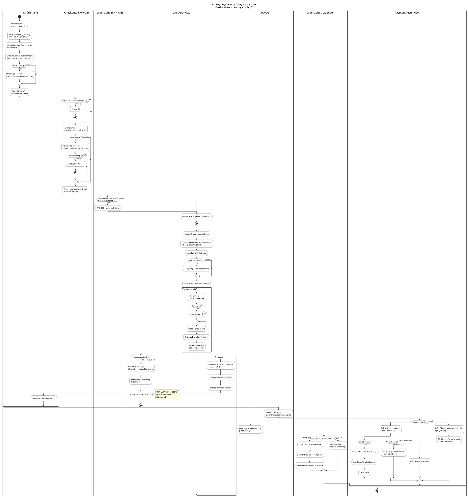
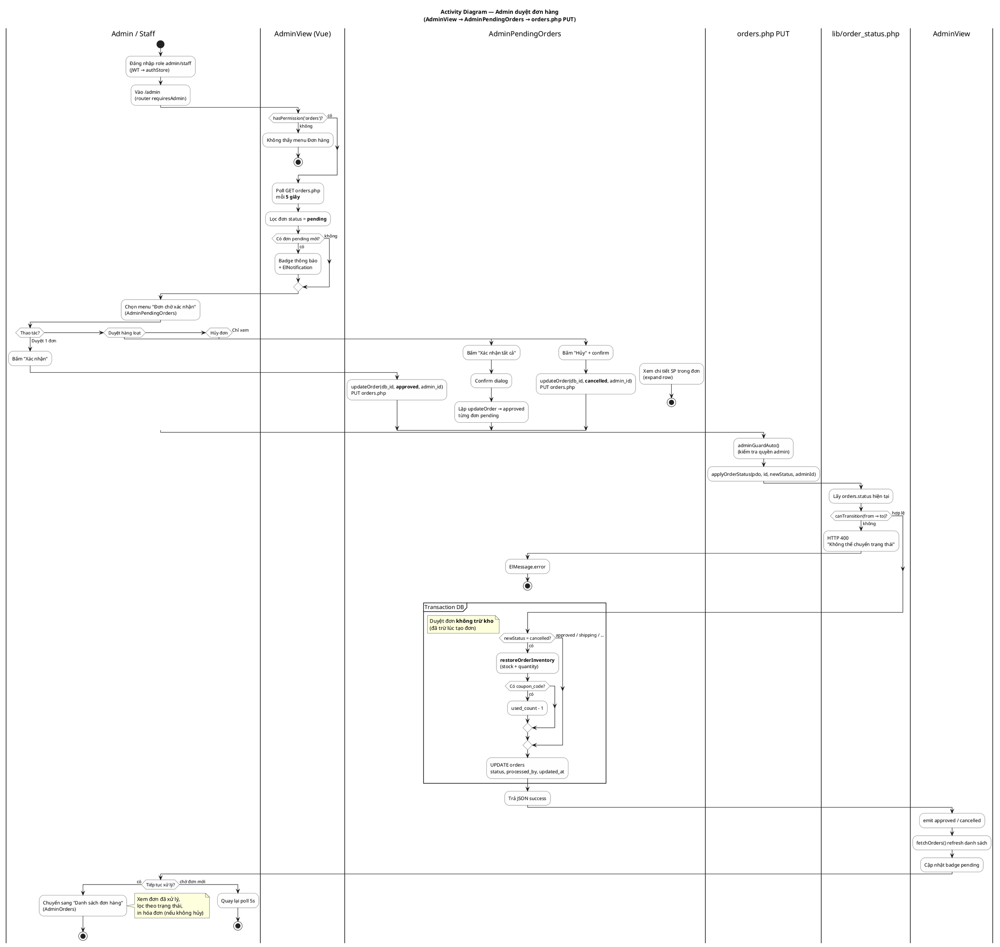

# Activity Diagram — Đèn Hoa Mỹ (Test Vue)

> **2 sơ đồ UML Activity** khớp code thực tế.  
> **Render:** copy khối `@startuml` → [PlantUML Online](https://www.plantuml.com/plantuml/uml/) hoặc VS Code extension **PlantUML**.

---

## 1. Luồng đặt hàng & thanh toán

**File liên quan:** `CheckoutView.vue` → `orderService.createOrder` → `orders.php` POST → `payos_helper.php` / `payos_webhook.php` → `PaymentResultView.vue`

**Ghi chú quan trọng khi bảo vệ:**
- Tiền tổng **server tính lại** (`order_pricing`, `coupon_apply`) — không tin số từ Vue.
- **Trừ kho ngay khi tạo đơn** (trong transaction POST), không đợi admin duyệt.
- **COD / pay_at_store:** đơn `pending` → admin duyệt sau (Diagram 2).
- **PayOS thành công:** webhook tự chuyển `pending` → `approved` (bỏ qua bước duyệt tay).



---

## 2. Luồng Admin duyệt đơn hàng

**File liên quan:** `AdminView.vue` (poll 5s) → `AdminPendingOrders.vue` → `orderService.updateOrder` → `orders.php` PUT → `lib/order_status.php`

**State machine đơn hàng:**
```
pending → approved → shipping → completed
   ↓         ↓           ↓
cancelled  cancelled   cancelled
```

**Ghi chú:** Kho đã trừ lúc tạo đơn. **Hủy đơn** mới **hoàn kho** + giảm `used_count` coupon.



---

## 3. Bảng mapping nhanh (đối chiếu code)

| Bước Activity | Vue | API / Lib |
|---------------|-----|-----------|
| Validate form checkout | `CheckoutView.handlePlaceOrder` | — |
| Tạo đơn | `orderService.createOrder` | `orders.php` POST |
| Trừ kho | — | `normalizeOrderItemsInTransaction` + UPDATE stock |
| PayOS link | — | `createPayosCheckoutForOrder` |
| Webhook | — | `payos_webhook.php` |
| Poll trạng thái | `PaymentResultView.pollUntilConfirmed` | `orders.php` GET payment status |
| Poll đơn pending | `AdminView` setInterval 5s | `orderService.getOrders` |
| Duyệt / Hủy | `AdminPendingOrders.approveOrder` | `orders.php` PUT + `applyOrderStatus` |
| Hoàn kho khi hủy | — | `restoreOrderInventory` |

---

## 4. Combo slide bảo vệ (gợi ý)

| Slide | Sơ đồ |
|-------|--------|
| Phạm vi chức năng | Use Case Diagram |
| Kiến trúc tổng | Flowchart (`SO_DO_LUONG_HE_THONG.md`) |
| Luồng mua hàng | **Activity Diagram 1** (file này) |
| Luồng vận hành | **Activity Diagram 2** (file này) |
| Dữ liệu | ERD PlantUML (`ERD_PLANTUML.md`) · chi tiết cột: `DATABASE_DESIGN.md` |
