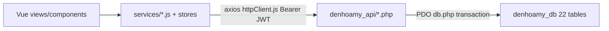
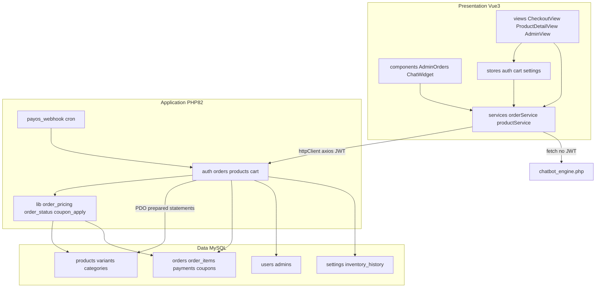
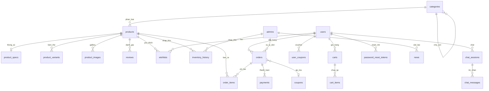
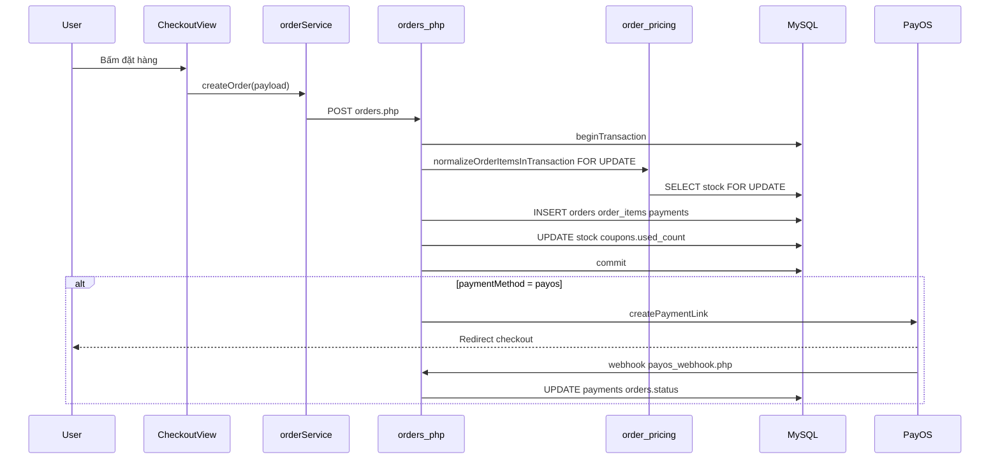
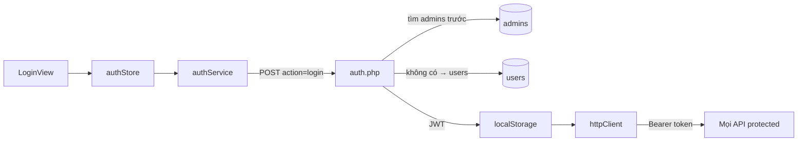

# Cơ sở dữ liệu & kết nối hệ thống — Đèn Hoa Mỹ (bảo vệ)

> **Đọc file này khi:** Hội đồng hỏi về CSDL, hoặc “dữ liệu lưu ở đâu, Vue/PHP nối thế nào?”  
> **Cấu trúc:** Khái quát → ERD → Map Vue/JS/PHP/DB → Luồng chi tiết → Tóm tắt bảng → Q&A  
> **Cập nhật:** 13/06/2026 · **22 bảng** · MySQL 8.0 · `denhoamy_db`

---

## Mục lục nhanh

| Phần | Nội dung |
|------|----------|
| [1. Khái quát](#phần-1--khái-quát) | 22 bảng, 3 tầng, điểm kỹ thuật |
| [2. ERD](#phần-2--erd--quan-hệ-cốt-lõi) | 6 cụm quan hệ |
| [3. Map toàn hệ thống](#phần-3--bảng-map-toàn-hệ-thống) | Vue → JS → PHP → DB |
| [4. Luồng chi tiết](#phần-4--luồng-dữ-liệu-chi-tiết) | Đặt hàng, đăng nhập, nhập kho |
| [5. Nhóm bảng](#phần-5--chi-tiết-csdl-theo-nhóm) | Tóm tắt + link phụ lục |
| [6. Q&A hội đồng](#phần-6--qa-hội-đồng) | 12 câu hay hỏi |
| [7. Phụ lục](#phần-7--mục-lục-phụ-lục) | File đọc sâu hơn |

**4 câu khi bảo vệ mỗi tính năng:** Màn Vue? · Service/store JS? · PHP? · Bảng DB?

---

## Phần 1 — Khái quát

### 1.1 Thông số CSDL

| Thuộc tính | Giá trị |
|------------|---------|
| RDBMS | MySQL **8.0.45** |
| Database | `denhoamy_db` |
| Engine | InnoDB |
| Charset | `utf8mb4_unicode_ci` (tiếng Việt đầy đủ) |
| Tổng bảng | **22** |
| Schema gốc | [denhoamy_db.sql](../../denhoamy_db.sql) |
| Kết nối backend | [denhoamy_api/db.php](../../denhoamy_api/db.php) — PDO, prepared statement |

### 1.2 Nhóm bảng theo domain

```
┌─────────────────────────────────────────────────────────────┐
│                    DATABASE: denhoamy_db                     │
├─────────────────────────────────────────────────────────────┤
│  SẢN PHẨM (5)                                               │
│  categories · products · product_variants · product_specs   │
│  · product_images                                           │
│                                                             │
│  THƯƠNG MẠI (6)                                             │
│  orders · order_items · payments · coupons · user_coupons   │
│  · carts · cart_items                                       │
│                                                             │
│  NGƯỜI DÙNG (3)                                             │
│  users · admins · password_reset_tokens                     │
│                                                             │
│  TƯƠNG TÁC (5)                                              │
│  reviews · wishlists · chat_sessions · chat_messages · news │
│                                                             │
│  HỆ THỐNG (2)                                               │
│  settings · inventory_history                               │
└─────────────────────────────────────────────────────────────┘
```

### 1.3 Kiến trúc kết nối (1 câu)

**Vue** (views/components) → **`services/*.js` + stores** → **PHP REST** (`denhoamy_api/*.php`) → **MySQL** (`denhoamy_db`).



### 1.4 Điểm kỹ thuật cần nhớ

| Kỹ thuật | Áp dụng ở đâu |
|----------|----------------|
| **PDO prepared statement** | Mọi query trong `denhoamy_api/*.php` |
| **`beginTransaction()`** | Đặt hàng (`orders.php`), đổi trạng thái (`lib/order_status.php`), nhập kho (`inventory.php`), webhook PayOS |
| **`SELECT ... FOR UPDATE`** | Khóa tồn kho khi đặt hàng — `lib/order_pricing.php` |
| **Soft delete** `deleted_at` | `products`, `categories`, `news`, `orders`, `reviews`, `users` |
| **JWT Bearer** | `httpClient.js` gắn token; `lib/jwt_helper.php` verify |
| **Snapshot giá** | `order_items.price`, `order_items.cost_price` tại thời điểm mua |

### 1.5 Sơ đồ 3 tầng đầy đủ



**Điểm vào HTTP phía Vue:** [my-vue-app/src/services/httpClient.js](../../my-vue-app/src/services/httpClient.js) — `VITE_API_URL`, interceptor gắn `Authorization: Bearer <token>`.

---

## Phần 2 — ERD & quan hệ cốt lõi

### 2.1 ERD tổng hợp



### 2.2 Sáu cụm hay bị hỏi

| Cụm | Bảng | Ý nghĩa |
|-----|------|---------|
| **Product** | `categories` → `products` → `product_variants` / `product_specs` / `product_images` | SP có biến thể kích thước + ánh sáng, giá/tồn riêng |
| **Order** | `orders` → `order_items` + `payments` + `coupons` | Đơn hàng, snapshot giá, thanh toán tách bảng |
| **User** | `users` (khách) vs `admins` (staff) | Tách bảng, RBAC qua `role` + `permissions` JSON |
| **Cart** | `carts` → `cart_items` | Giỏ persistent khi customer login |
| **Chat** | `chat_sessions` → `chat_messages` | Lưu hội thoại AI (tool tra `products`) |
| **Config** | `settings` | Key-value: logo, banner, policy HTML |

### 2.3 Quyết định thiết kế quan trọng

| Quyết định | Lý do |
|------------|-------|
| **Snapshot** `order_items.product_name`, `price`, `cost_price` | Giá SP đổi theo thời gian; hóa đơn cũ phải giữ đúng số liệu |
| **`orders.user_id` NULL** | Khách vãng lai đặt hàng không cần tài khoản; vẫn lưu `customer_name`, `phone`, `address` |
| **FK `ON DELETE CASCADE`** | Xóa cart → xóa `cart_items`; xóa order → xóa `order_items`, `payments` |
| **FK `ON DELETE SET NULL`** | Xóa user → `orders.user_id` = NULL (giữ lịch sử bán); xóa product → `order_items.product_id` = NULL (còn snapshot tên/giá) |
| **Tách `payments`** | Theo dõi giao dịch, retry PayOS, trạng thái `pending/completed/failed` |

---

## Phần 3 — Bảng map toàn hệ thống

### Bảng A — PHP endpoint ↔ Bảng DB ↔ Service JS

| PHP | Bảng DB chính | Service JS | Ghi chú |
|-----|---------------|------------|---------|
| `auth.php` | `users`, `admins` | `authService.js` | Login: tìm `admins` trước, rồi `users`; JWT HS256 |
| `forgot-password.php` | `users`, `password_reset_tokens` | `authService.js` | Magic link reset MK (Resend email) |
| `users.php` | `users`, `admins` | `userService.js` | Profile, quản lý khách/staff |
| `categories.php` | `categories` | `categoryService.js` | Cây danh mục `parent_id` |
| `products.php` | `products`, `product_variants`, `product_specs`, `product_images` | `productService.js` | Soft delete, hot deal, import |
| `cart.php` | `carts`, `cart_items` | `cartService.js` | Chỉ customer đã login |
| `orders.php` | `orders`, `order_items`, `payments`, `coupons` | `orderService.js` | Transaction, trừ kho, PayOS |
| `coupons.php` | `coupons`, `user_coupons` | `couponService.js` | Admin CRUD + checkout apply |
| `payments` *(qua orders)* | `payments` | `orderService.js` | Tạo cùng lúc đặt hàng |
| `payos_webhook.php` | `payments`, `orders` | — | PayOS server POST, HMAC verify |
| `reviews.php` | `reviews` | `reviewService.js` | Admin duyệt `is_approved` |
| `wishlist.php` | `wishlists` | `wishlistService.js` | Yêu thích theo `user_id` |
| `news.php` | `news` | `newsService.js` | Slug unique, `author_id` → `admins` |
| `settings.php` | `settings` | `settingsService.js` | Key-value toàn site |
| `statistics.php` | `orders`, `order_items`, `products` | `statisticsService.js` | Dashboard doanh thu |
| `inventory.php` | `inventory_history`, `products`, `product_variants` | `inventoryService.js` | Nhập/xuất kho + audit |
| `upload.php` | *(filesystem)* | `uploadService.js` | Ảnh SP, banner, logo |
| `chatbot_engine.php` | `products`, `chat_sessions`, `chat_messages` | `chatService.js` | `fetch` (không axios), không JWT |

**Endpoint không qua Vue (axios):**

| PHP | Ai gọi | Bảng DB |
|-----|--------|---------|
| `payos_webhook.php` | PayOS server | `payments`, `orders` |
| `cron_cancel_orders.php` | Cron hệ thống | `orders`, `products`, `product_variants`, `coupons` |
| `cron_progress_orders.php` | Cron hệ thống | `orders` |

---

### Bảng B — Vue View/Component ↔ Service ↔ PHP ↔ DB

| Tính năng | Vue | JS | PHP (+ lib) | Bảng DB |
|-----------|-----|-----|-------------|---------|
| Khởi động app | `App.vue` | `settingsStore` | `settings.php` | `settings` |
| Trang chủ | `HomeView` | `productService` | `products.php` | `products` |
| Danh mục / lọc SP | `CategoryView` | `productService` | `products.php`, `lib/products_filters.php` | `products`, `categories` |
| Chi tiết SP | `ProductDetailView` | `productService`, `reviewService` | `products.php`, `reviews.php` | `products`, `product_variants`, `reviews` |
| Thêm giỏ (guest) | — | `cartStore` | — | `localStorage` |
| Giỏ hàng (login) | `CartView` | `cartStore` → `cartService` | `cart.php`, `lib/cart_helpers.php` | `carts`, `cart_items` |
| Thanh toán | `CheckoutView` | `orderService`, `couponService` | `orders.php`, `lib/order_pricing.php`, `lib/coupon_apply.php` | `orders`, `order_items`, `payments`, `coupons` |
| Kết quả PayOS | `PaymentResultView` | `orderService` | `orders.php`, `payos_webhook.php` | `orders`, `payments` |
| Đăng ký | `RegisterView` | `authService` | `auth.php` | `users` |
| Đăng nhập | `LoginView` | `authStore` → `authService` | `auth.php`, `lib/jwt_helper.php` | `users`, `admins` |
| Quên MK | `ForgotPasswordView` | `authService` | `forgot-password.php`, `lib/password_reset_helper.php` | `users`, `password_reset_tokens` |
| Reset MK | `ResetPasswordView` | `authService` | `forgot-password.php` | `users`, `password_reset_tokens` |
| Profile / đơn của tôi | `ProfileView` | `userService`, `orderService`, `wishlistService` | `users.php`, `orders.php`, `wishlist.php` | `users`, `orders`, `wishlists` |
| Tin tức | `NewsView`, `NewsDetailView` | `newsService` | `news.php` | `news` |
| Chính sách | `PolicyView` | `settingsStore` | `settings.php` | `settings` (`policy_*`) |
| Chatbot | `ChatWidget` | `chatService` | `chatbot_engine.php` | `products`, `chat_sessions`, `chat_messages` |
| Admin shell | `AdminView` | nhiều service | nhiều endpoint | — |
| Dashboard | `AdminDashboard` | `statisticsService`, `orderService` | `statistics.php`, `orders.php` | `orders`, `order_items` |
| Danh mục admin | `AdminCategories` | `categoryService` | `categories.php` | `categories` |
| Sản phẩm admin | `AdminProducts` | `productService`, `uploadService`, `inventoryService` | `products.php`, `upload.php`, `inventory.php` | `products`, `product_variants`, `inventory_history` |
| Đơn chờ duyệt | `AdminPendingOrders` | `orderService` | `orders.php`, `lib/order_status.php` | `orders`, `products`, `product_variants`, `coupons` |
| Đơn đã xử lý | `AdminOrders` | `orderService` | `orders.php` | `orders`, `order_items` |
| Hot deal | `AdminHotDeal` | `productService` | `products.php`, `lib/hot_deal_snapshot.php` | `products`, `product_variants` |
| Mã giảm giá | `AdminCoupons` | `couponService` | `coupons.php` | `coupons` |
| Đánh giá | `AdminReviews` | `reviewService` | `reviews.php` | `reviews` |
| Tin tức admin | `AdminNews` | `newsService`, `uploadService` | `news.php`, `upload.php` | `news` |
| Chính sách admin | `AdminPolicy` | `settingsService` | `settings.php` | `settings` |
| Cài đặt web | `AdminSettings` | `settingsService`, `uploadService` | `settings.php`, `upload.php` | `settings` |
| Users / staff | `AdminUsers` | `userService` | `users.php` | `users`, `admins` |

---

### Bảng C — PHP lib ↔ Bảng DB

| Lib PHP | Vai trò | Bảng đụng |
|---------|---------|-----------|
| `lib/order_pricing.php` | Lock stock `FOR UPDATE`, chuẩn hóa item, tính subtotal | `products`, `product_variants` |
| `lib/order_status.php` | State machine đơn; hoàn kho + coupon khi hủy | `orders`, `order_items`, `coupons` |
| `lib/coupon_apply.php` | Validate & tính `discount_amount` | `coupons` |
| `lib/cart_helpers.php` | Enrich giỏ từ DB (giá, tên, ảnh) | `carts`, `cart_items`, `products`, `product_variants` |
| `lib/payos_helper.php` | Tạo link PayOS, verify webhook HMAC | `payments`, `orders` |
| `lib/payos_order_helpers.php` | Chặn đơn PayOS trùng, retry link | `orders`, `payments` |
| `lib/hot_deal_snapshot.php` | Snapshot giá trước/sau hot deal | `products`, `product_variants` |
| `lib/products_filters.php` | Lọc theo `loai_den`, facets, category | `products`, `categories` |
| `lib/password_reset_helper.php` | Token hash, expiry | `password_reset_tokens`, `users` |
| `lib/auth_middleware.php` | `requireLogin`, role check | `users`, `admins` |
| `lib/admin_route_guard.php` | Map endpoint → permission key | `admins.permissions` |
| `lib/order_email_helper.php` | Email xác nhận đơn (Resend) | `orders`, `order_items` |

---

### Bảng D — Store Pinia ↔ DB (gián tiếp)

| Store | File | Hydrate từ | Bảng DB |
|-------|------|------------|---------|
| `auth` | `stores/auth.js` | `authService` → `auth.php` | `users` hoặc `admins` |
| `cart` | `stores/cart.js` | `cartService` (login) + `localStorage` (guest) | `carts`, `cart_items` |
| `settings` | `stores/settings.js` | `settingsService` → `settings.php` | `settings` |

---

## Phần 4 — Luồng dữ liệu chi tiết

### Luồng 1 — Đặt hàng (quan trọng nhất)



| Bước | Thao tác DB tiêu biểu |
|------|----------------------|
| 1 | `BEGIN` transaction |
| 2 | `SELECT stock, price FROM product_variants WHERE id = ? FOR UPDATE` |
| 3 | `INSERT INTO orders (...)` — `status = 'pending'` |
| 4 | `INSERT INTO order_items (order_id, product_id, variant_id, product_name, quantity, price, cost_price)` |
| 5 | `UPDATE product_variants SET stock = stock - ? WHERE id = ?` |
| 6 | `INSERT INTO payments (order_id, amount, method, status)` |
| 7 | `UPDATE coupons SET used_count = used_count + 1 WHERE code = ?` (nếu có mã) |
| 8 | `COMMIT` |
| Hủy đơn | `restoreOrderInventory()` — `stock + quantity`, `used_count - 1` |

**File minh chứng:** [denhoamy_api/orders.php](../../denhoamy_api/orders.php) (dòng ~299–390), [denhoamy_api/lib/order_pricing.php](../../denhoamy_api/lib/order_pricing.php).

**Nhớ:** Tổng tiền **server tính lại** — Vue không được quyết định `total` cuối cùng.

---

### Luồng 2 — Đăng nhập & phân quyền



| Vai trò | Bảng | Quyền admin |
|---------|------|-------------|
| Khách | `users` | Chỉ trang customer |
| Staff | `admins` (`role=staff`) | Theo `permissions` JSON |
| Admin | `admins` (`role=admin`) | Toàn quyền |

**File minh chứng:** [my-vue-app/src/services/httpClient.js](../../my-vue-app/src/services/httpClient.js), [denhoamy_api/auth.php](../../denhoamy_api/auth.php), [denhoamy_api/lib/admin_route_guard.php](../../denhoamy_api/lib/admin_route_guard.php).

---

### Luồng 3 — Admin nhập kho

| Bước | Vue | PHP | DB |
|------|-----|-----|-----|
| 1 | `AdminProducts` — form nhập kho | | |
| 2 | `inventoryService.post()` | `inventory.php` | |
| 3 | | `beginTransaction` | |
| 4 | | `INSERT inventory_history (product_id, variant_id, admin_id, type, quantity, cost, note)` | `inventory_history` |
| 5 | | `UPDATE products SET stock = stock + ?` hoặc `product_variants` | `products` / `product_variants` |
| 6 | | `commit` | |

**File minh chứng:** [denhoamy_api/inventory.php](../../denhoamy_api/inventory.php).

---

## Phần 5 — Chi tiết CSDL theo nhóm

> Chi tiết từng cột → [DATABASE_DESIGN.md](../DATABASE_DESIGN.md) · Schema SQL → [denhoamy_db.sql](../../denhoamy_db.sql)

### 5.1 Sản phẩm (5 bảng)

| Bảng | Vai trò | Ai đọc/ghi |
|------|---------|------------|
| `categories` | Menu danh mục cây `parent_id` | `categories.php`, `AdminCategories` |
| `products` | SP chính: tên, mã, giá, `loai_den`, `stock`, hot deal | `products.php`, chatbot tool |
| `product_variants` | Biến thể: `kich_thuoc`, `anh_sang`, giá/tồn riêng | `products.php`, `orders.php` (trừ kho) |
| `product_specs` | Thông số kỹ thuật 1:1 | `products.php` |
| `product_images` | Gallery ảnh | `products.php` |

**Lưu ý:** Nhiều SP dùng `loai_den` (text) để filter nhanh; `category_id` dùng cho menu web — có thể NULL.

### 5.2 Thương mại (6 bảng + giỏ)

| Bảng | Vai trò | Ai đọc/ghi |
|------|---------|------------|
| `orders` | Header đơn: khách, địa chỉ, `status`, coupon, `total` | `orders.php`, `statistics.php`, cron |
| `order_items` | Snapshot SP + giá + cost tại thời điểm mua | `orders.php` |
| `payments` | Giao dịch: method, status, `payment_code` | `orders.php`, `payos_webhook.php` |
| `coupons` | Mã giảm: %, số tiền, limit, ngày | `coupons.php`, `lib/coupon_apply.php` |
| `user_coupons` | Ví voucher khách (claimed/used) | `coupons.php` |
| `carts` / `cart_items` | Giỏ persistent (customer login) | `cart.php` |

**Trạng thái đơn:** `pending` → `approved` → `shipping` → `completed` (hoặc `cancelled`). State machine: `lib/order_status.php`.

### 5.3 Người dùng (3 bảng)

| Bảng | Vai trò |
|------|---------|
| `users` | Khách: username = SĐT, `is_locked`, soft delete |
| `admins` | Staff/admin: `role`, `permissions` JSON, bcrypt password |
| `password_reset_tokens` | Token hash, `expires_at`, `used_at` |

### 5.4 Tương tác (5 bảng)

| Bảng | Vai trò |
|------|---------|
| `reviews` | Đánh giá SP; `is_approved` admin duyệt; `user_name` khi guest |
| `wishlists` | SP yêu thích theo `user_id` |
| `news` | Blog: `slug` unique, `author_id`, soft delete |
| `chat_sessions` | Phiên chat: `session_token`, `user_id` nullable |
| `chat_messages` | Tin nhắn `user` / `bot` |

### 5.5 Hệ thống (2 bảng)

| Bảng | Vai trò |
|------|---------|
| `settings` | Key-value: `shop_name`, `hotline`, `banner_urls`, `policy_*` |
| `inventory_history` | Audit nhập/xuất: `type` in/out, `cost`, `admin_id` |

---

## Phần 6 — Q&A hội đồng

Format: **Hỏi → Trả lời 30s → Minh chứng**

---

**1. Tại sao tách `users` và `admins`?**

Khách và nhân viên là hai domain khác: quyền, luồng đăng nhập, dữ liệu liên kết khác nhau. Tách bảng giúp JWT không lẫn role, RBAC qua `admins.permissions` JSON mà không ảnh hưởng bảng khách.

→ `admins`, `users` · `auth.php` · `lib/admin_route_guard.php`

---

**2. Product vs Variant — thiết kế thế nào?**

Một mẫu đèn có nhiều kích thước và ánh sáng → giá và tồn kho khác nhau. `products` giữ thông tin chung; `product_variants` giữ `kich_thuoc`, `anh_sang`, `price`, `stock`.

→ `products`, `product_variants` · `products.php` · `ProductDetailView`

---

**3. Tại sao `order_items` lưu `product_name`, `price`?**

Snapshot tại thời điểm mua. Giá SP có thể đổi (hot deal, admin sửa); đơn cũ phải giữ đúng số liệu doanh thu và hóa đơn.

→ `order_items` · `orders.php` INSERT item · [DATABASE_DESIGN.md](../DATABASE_DESIGN.md)

---

**4. Race condition tồn kho — xử lý ra sao?**

Transaction + `SELECT ... FOR UPDATE` trong `normalizeOrderItemsInTransaction`. Request thứ hai chờ lock; nếu hết hàng → rollback, báo lỗi.

→ `lib/order_pricing.php` · `orders.php` `beginTransaction`

---

**5. Tại sao tách `payments`?**

Theo dõi giao dịch độc lập: method, status, mã PayOS, evidence. Một đơn có thể retry thanh toán mà không làm phình `orders`.

→ `payments` · `orders.php`, `payos_webhook.php`

---

**6. Soft delete dùng ở đâu?**

`deleted_at` trên `products`, `orders`, `news`, `users`… Query luôn `WHERE deleted_at IS NULL`. Giữ lịch sử, tránh lỗi FK.

→ `products.php`, `news.php`, `orders.php`

---

**7. `categories` cây phân cấp?**

`parent_id` self-reference: NULL = danh mục gốc (Đèn Chùm), có `parent_id` = danh mục con (Đèn Chùm Cổ Điển).

→ `categories` · `categories.php` · `AdminCategories`

---

**8. Coupon thiết kế ra sao?**

`coupons`: % hoặc số tiền cố định, `min_order_value`, `usage_limit`, `used_count`, ngày hiệu lực. Server tính lại discount — không tin client. `user_coupons` lưu voucher khách đã claim.

→ `coupons`, `user_coupons` · `lib/coupon_apply.php` · `CheckoutView`

---

**9. Chatbot lưu DB thế nào?**

`chat_sessions` + `chat_messages` lưu hội thoại. AI tra `products` qua tool calling trong `chatbot_engine.php` — không bịa giá.

→ `chat_sessions`, `chat_messages`, `products` · `ChatWidget` · `chatService.js`

---

**10. Chuẩn hóa / denormalize cố ý?**

Phần lớn 3NF. Cố ý denormalize: snapshot `order_items`, thông tin giao hàng trên `orders` (khách vãng lai), `reviews.user_name`.

→ `order_items`, `orders`

---

**11. Index & Foreign Key?**

PK tất cả bảng; UNIQUE: `admins.username`, `coupons.code`, `news.slug`; INDEX: `orders.status`, `chat_sessions.session_token`. FK đầy đủ với CASCADE/SET NULL hợp lý.

→ [denhoamy_db.sql](../../denhoamy_db.sql) phần ALTER CONSTRAINT

---

**12. Demo query nhanh (mở phpMyAdmin)**

```sql
-- Sản phẩm + biến thể
SELECT p.ten_san_pham, p.ma_san_pham, pv.kich_thuoc, pv.anh_sang, pv.price, pv.stock
FROM products p
JOIN product_variants pv ON pv.product_id = p.id
WHERE p.deleted_at IS NULL
LIMIT 5;

-- Đơn hàng + snapshot giá
SELECT o.id, o.customer_name, o.total, o.status,
       oi.product_name, oi.quantity, oi.price
FROM orders o
JOIN order_items oi ON oi.order_id = o.id
WHERE o.deleted_at IS NULL
ORDER BY o.id DESC LIMIT 3;

-- Thống kê đơn theo trạng thái
SELECT status, COUNT(*) AS so_don, SUM(total) AS doanh_thu
FROM orders WHERE deleted_at IS NULL
GROUP BY status;
```

---

## Phần 7 — Mục lục phụ lục

| Cần gì | File |
|--------|------|
| Luồng nghiệp vụ A–J (user bấm gì) | [LUONG_NGHIEP_VU.md](../../my-vue-app/docs/explain/LUONG_NGHIEP_VU.md) |
| Chi tiết từng cột DB | [DATABASE_DESIGN.md](../DATABASE_DESIGN.md) |
| Kiến trúc Docker 4 container | [ARCHITECTURE.md](../ARCHITECTURE.md) |
| API từng endpoint | [denhoamy_api/docs/explain/](../../denhoamy_api/docs/explain/) |
| Schema SQL gốc | [denhoamy_db.sql](../../denhoamy_db.sql) |
| Sơ đồ hệ thống (slide) | [SO_DO_LUONG_HE_THONG.md](./SO_DO_LUONG_HE_THONG.md) |
| Hướng dẫn bảo vệ tổng | [HUONG_DAN_BAO_VE.md](../HUONG_DAN_BAO_VE.md) |
| Map file Vue | [MAP_TOAN_BO.md](../../my-vue-app/docs/explain/MAP_TOAN_BO.md) |

---

## Checklist ôn 10 phút

- [ ] Nêu được **22 bảng** và **6 nhóm** domain
- [ ] Trace **CheckoutView → orderService → orders.php → orders/order_items/payments**
- [ ] Giải thích **snapshot** `order_items` và **FOR UPDATE**
- [ ] Phân biệt **users** vs **admins**, guest giỏ vs customer giỏ
- [ ] Biết **payos_webhook.php** không qua Vue
- [ ] Mở được 3 câu SQL demo ở Phần 6
