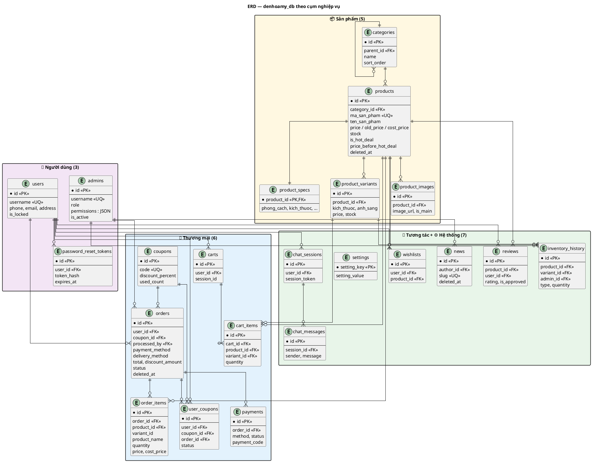

# ERD — Đèn Hoa Mỹ (PlantUML)

> **22 bảng** · khớp `denhoamy_db.sql` + `docs/DATABASE_DESIGN.md`  
> **Render:** copy khối `@startuml` → [PlantUML Online](https://www.plantuml.com/plantuml/uml/) hoặc VS Code extension **PlantUML**.

---

## 1. ERD tổng thể (quan hệ — gọn cho slide)

Chỉ hiện **PK/FK** và cardinality. Đủ để đối chiếu nhanh 22 bảng.

```plantuml
@startuml ERD_DenHoamy_Overview
title ERD — denhoamy_db (22 bảng)\nQuan hệ theo FOREIGN KEY thực tế

skinparam linetype ortho
skinparam shadowing false
skinparam BackgroundColor #FEFEFE
skinparam entity {
  BackgroundColor #FFFDE7
  BorderColor #333
}

' ── Sản phẩm ──
entity "categories" as categories {
  * **id** : INT <<PK>>
  --
  parent_id : INT <<FK self>>
}

entity "products" as products {
  * **id** : INT <<PK>>
  --
  category_id : INT <<FK>>
  deleted_at : TIMESTAMP
}

entity "product_specs" as product_specs {
  * **product_id** : INT <<PK, FK>>
}

entity "product_variants" as product_variants {
  * **id** : INT <<PK>>
  --
  product_id : INT <<FK>>
}

entity "product_images" as product_images {
  * **id** : INT <<PK>>
  --
  product_id : INT <<FK>>
}

' ── Thương mại ──
entity "orders" as orders {
  * **id** : INT <<PK>>
  --
  user_id : INT <<FK>>
  coupon_id : INT <<FK>>
  processed_by : INT <<FK>>
  deleted_at : TIMESTAMP
}

entity "order_items" as order_items {
  * **id** : INT <<PK>>
  --
  order_id : INT <<FK>>
  product_id : INT <<FK>>
  variant_id : INT
  price : DECIMAL <<snapshot>>
}

entity "payments" as payments {
  * **id** : INT <<PK>>
  --
  order_id : INT <<FK>>
}

entity "coupons" as coupons {
  * **id** : INT <<PK>>
  --
  code : VARCHAR <<UNIQUE>>
}

entity "user_coupons" as user_coupons {
  * **id** : INT <<PK>>
  --
  user_id : INT <<FK>>
  coupon_id : INT <<FK>>
  order_id : INT <<FK>>
}

entity "carts" as carts {
  * **id** : INT <<PK>>
  --
  user_id : INT <<FK>>
}

entity "cart_items" as cart_items {
  * **id** : INT <<PK>>
  --
  cart_id : INT <<FK>>
  product_id : INT <<FK>>
  variant_id : INT <<FK>>
}

' ── Người dùng ──
entity "users" as users {
  * **id** : INT <<PK>>
  --
  is_locked : BOOLEAN
}

entity "admins" as admins {
  * **id** : INT <<PK>>
  --
  role : ENUM(admin, staff)
  permissions : JSON
}

entity "password_reset_tokens" as pwd_tokens {
  * **id** : INT <<PK>>
  --
  user_id : INT <<FK>>
}

' ── Tương tác ──
entity "reviews" as reviews {
  * **id** : INT <<PK>>
  --
  product_id : INT <<FK>>
  user_id : INT <<FK>>
}

entity "wishlists" as wishlists {
  * **id** : INT <<PK>>
  --
  user_id : INT <<FK>>
  product_id : INT <<FK>>
}

entity "chat_sessions" as chat_sessions {
  * **id** : INT <<PK>>
  --
  user_id : INT <<FK>>
}

entity "chat_messages" as chat_messages {
  * **id** : INT <<PK>>
  --
  session_id : INT <<FK>>
}

entity "news" as news {
  * **id** : INT <<PK>>
  --
  author_id : INT <<FK>>
  deleted_at : TIMESTAMP
}

' ── Hệ thống ──
entity "settings" as settings {
  * **setting_key** : VARCHAR <<PK>>
  --
  setting_value : MEDIUMTEXT
}

entity "inventory_history" as inventory_history {
  * **id** : INT <<PK>>
  --
  product_id : INT <<FK>>
  variant_id : INT <<FK>>
  admin_id : INT <<FK>>
}

' ── Quan hệ ──
categories ||--o{ categories : parent_id
categories ||--o{ products : category_id

products ||--|| product_specs : 1:1
products ||--o{ product_variants
products ||--o{ product_images
products ||--o{ reviews
products ||--o{ wishlists
products ||--o{ order_items
products ||--o{ cart_items
products ||--o{ inventory_history

product_variants ||--o{ cart_items
product_variants ||--o{ inventory_history
product_variants }o..o{ order_items : variant_id\n**(không có FK trong SQL)**

users ||--o{ orders
users ||--o{ reviews
users ||--o{ wishlists
users ||--o{ user_coupons
users ||--o{ chat_sessions
users ||--o{ password_reset_tokens
users ||--o{ carts

admins ||--o{ orders : processed_by
admins ||--o{ news : author_id
admins ||--o{ inventory_history

orders ||--o{ order_items
orders ||--o{ payments
orders ||--o{ user_coupons

coupons ||--o{ orders : coupon_id
coupons ||--o{ user_coupons

carts ||--o{ cart_items

chat_sessions ||--o{ chat_messages

note bottom of settings
  **settings** — Key-Value độc lập,
  không FK tới bảng khác
end note

@enduml
```

---

## 2. ERD theo cụm (chi tiết cột chính)

Dùng khi cần zoom từng domain. Cùng một schema, tách 4 package cho dễ đọc.

---

## 3. Bảng đối chiếu FK (SQL ↔ sơ đồ)

| Bảng con | Cột FK | Bảng cha | ON DELETE | Có trong ERD? |
|----------|--------|----------|-----------|:-------------:|
| `categories` | `parent_id` | `categories` | CASCADE | ✓ |
| `products` | `category_id` | `categories` | SET NULL | ✓ |
| `product_specs` | `product_id` | `products` | CASCADE | ✓ (1:1) |
| `product_variants` | `product_id` | `products` | CASCADE | ✓ |
| `product_images` | `product_id` | `products` | CASCADE | ✓ |
| `orders` | `user_id` | `users` | SET NULL | ✓ |
| `orders` | `coupon_id` | `coupons` | SET NULL | ✓ |
| `orders` | `processed_by` | `admins` | SET NULL | ✓ |
| `order_items` | `order_id` | `orders` | CASCADE | ✓ |
| `order_items` | `product_id` | `products` | SET NULL | ✓ |
| `order_items` | `variant_id` | `product_variants` | — | ⚠ **không FK** |
| `payments` | `order_id` | `orders` | CASCADE | ✓ |
| `user_coupons` | `user_id` | `users` | CASCADE | ✓ |
| `user_coupons` | `coupon_id` | `coupons` | CASCADE | ✓ |
| `user_coupons` | `order_id` | `orders` | SET NULL | ✓ |
| `carts` | `user_id` | `users` | CASCADE | ✓ |
| `cart_items` | `cart_id` | `carts` | CASCADE | ✓ |
| `cart_items` | `product_id` | `products` | CASCADE | ✓ |
| `cart_items` | `variant_id` | `product_variants` | SET NULL | ✓ |
| `reviews` | `product_id` | `products` | CASCADE | ✓ |
| `reviews` | `user_id` | `users` | SET NULL | ✓ |
| `wishlists` | `user_id` | `users` | CASCADE | ✓ |
| `wishlists` | `product_id` | `products` | CASCADE | ✓ |
| `chat_sessions` | `user_id` | `users` | SET NULL | ✓ |
| `chat_messages` | `session_id` | `chat_sessions` | CASCADE | ✓ |
| `news` | `author_id` | `admins` | SET NULL | ✓ |
| `password_reset_tokens` | `user_id` | `users` | CASCADE | ✓ |
| `inventory_history` | `product_id` | `products` | CASCADE | ✓ |
| `inventory_history` | `variant_id` | `product_variants` | SET NULL | ✓ |
| `inventory_history` | `admin_id` | `admins` | SET NULL | ✓ |
| `settings` | — | — | — | độc lập |

---

## 4. Điểm cần nhớ khi bảo vệ (khớp ERD)

1. **`order_items.variant_id`** — có trong DB và code, **không có CONSTRAINT FK** trong `denhoamy_db.sql` (nét đứt trên sơ đồ).
2. **`order_items.price` / `cost_price`** — snapshot lúc mua, không phụ thuộc giá `products` hiện tại.
3. **`users` ≠ `admins`** — hai bảng tách, không FK chéo.
4. **Soft delete:** `products`, `orders`, `news` — cột `deleted_at` (migration, không có trong CREATE gốc một số bảng).
5. **`settings`** — Key-Value, không quan hệ FK.

---

## 5. Combo slide (gợi ý)

| Slide | Sơ đồ |
|-------|--------|
| CSDL tổng quan | **ERD §1** (overview) |
| Chi tiết domain | **ERD §2** (theo cụm) — phụ lục |
| Cột từng bảng | `DATABASE_DESIGN.md` |
