# Sơ đồ cho Slide — Đèn Hoa Mỹ

> Export: dán Mermaid vào [mermaid.live](https://mermaid.live) hoặc draw.io, xuất PNG/SVG cho PowerPoint.  
> Gắn vào slide theo cột **Slide** bên dưới.

---

## D1 — Kiến trúc 3-tier (Slide 13)

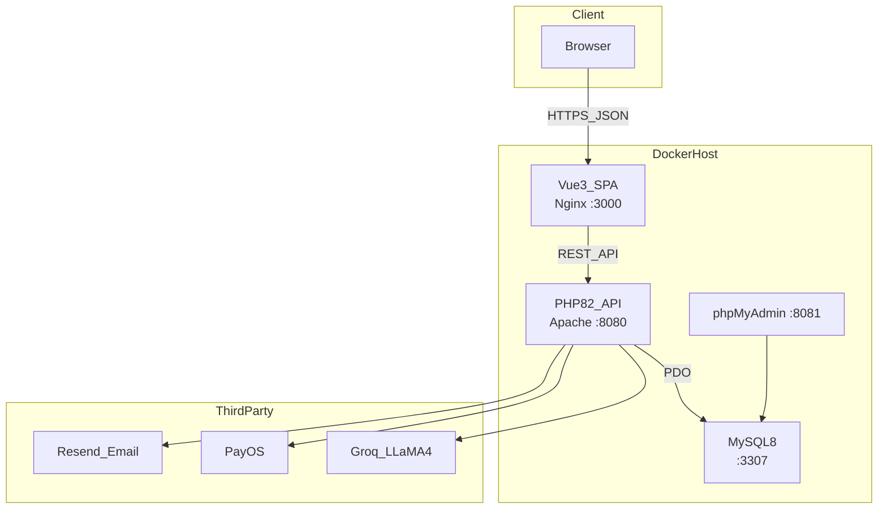

---

## D2 — Docker Compose services (Slide 14)

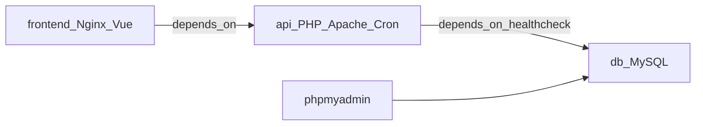

---

## D3 — Request lifecycle Backend (Slide 18)

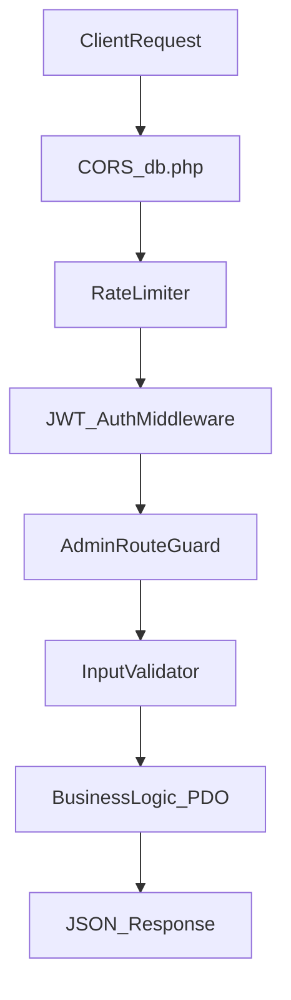

---

## D4 — Giỏ hàng & đồng bộ (Slide 23)

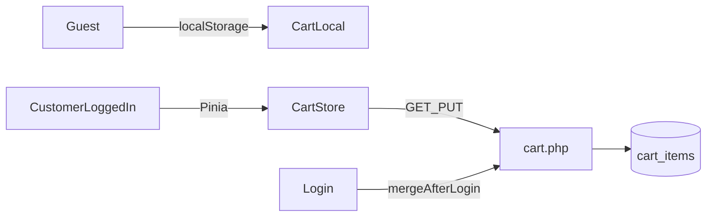

---

## D5 — Luồng đặt hàng & PayOS (Slide 24–25)

```mermaid
flowchart TD
  start[CustomerCheckout] --> delivery{deliveryMethod}
  delivery -->|home| pttm1[COD_or_PayOS]
  delivery -->|store| pttm2[pay_at_store_or_PayOS]
  pttm1 --> createOrder[POST_orders.php]
  pttm2 --> createOrder
  createOrder --> lockStock[Transaction_FOR_UPDATE]
  lockStock --> payChoice{payment}SLIDE — TRIỂN KHAI PRODUCTION
  Tiêu đề gợi ý
  TRIỂN KHAI HỆ THỐNG LÊN SERVER PUBLIC
  
  Phần: Cài đặt & Demo / Kết luận
  
  Dòng mở:
  
  Sau khi phát triển local bằng Docker, hệ thống được đưa lên VPS INET — gắn domain, bật HTTPS Let's Encrypt, chạy public cho khách truy cập thật.
  
  Layout gợi ý: Trái = 5 bước | Phải = sơ đồ kiến trúc
  5 BƯỚC TRIỂN KHAI (nội dung chính slide)
  ① Thuê hạ tầng & chuẩn bị server
  Mục đích: Có máy chủ Linux ổn định, đủ tài nguyên chạy Docker stack.
  
  Hạng mục	Cấu hình thực tế
  Nhà cung cấp
  INET — Cloud Server
  Quản trị
  CloudPanel (quản lý site, SSL, reverse proxy)
  OS
  Ubuntu 24.04 LTS
  CPU / RAM / Disk
  2 vCPU · 3 GB RAM · SSD 30 GB
  Cài đặt trên VPS:
  
  Docker + Docker Compose
  Git (clone/pull mã nguồn)
  Mở port 80, 443 (HTTP/HTTPS)
  3 GB RAM đủ cho 4 container: frontend, API, MySQL, phpMyAdmin — phù hợp quy mô shop vừa.
  
  ② Đăng ký domain & trỏ DNS (INET)
  Mục đích: Khách truy cập bằng tên miền thay vì IP.
  
  Mua domain tại INET (vd: denhoamy.store)
  Trỏ A record → IP VPS
  (Tuỳ chọn) www → cùng IP hoặc CNAME
  Kết quả: https://denhoamy.store trỏ về server production.
  
  ③ Cấu hình HTTPS — Let's Encrypt
  Mục đích: Mã hóa kết nối — bắt buộc cho PayOS webhook, reset mật khẩu, niềm tin khách hàng.
  
  Tạo site trên CloudPanel
  Bật SSL Let's Encrypt (miễn phí, auto-renew)
  CloudPanel Nginx làm reverse proxy:
  443 HTTPS → container frontend (127.0.0.1:3000)
  API public qua path hoặc subdomain (vd: / proxy hoặc api.domain)
  Production: FRONTEND_URL=https://denhoamy.store trong .env — PayOS return URL, email magic link dùng domain HTTPS.
  
  ④ Deploy ứng dụng bằng Docker
  Mục đích: Môi trường production giống local — một lệnh khởi chạy toàn stack.
  
  git clone <repo> /root/denhoamy-ecommerce
  cd /root/denhoamy-ecommerce
  cp .env.example .env   # chỉnh secret production
  docker compose up -d --build
  4 container chạy trên VPS:
  
  Container	Vai trò	Port nội bộ
  denhoamy_frontend
  Vue 3 build + Nginx
  127.0.0.1:3000
  denhoamy_api
  PHP 8.2 + Apache
  127.0.0.1:8080
  denhoamy_db
  MySQL 8.0
  nội bộ Docker
  denhoamy_pma
  phpMyAdmin (quản trị DB)
  8081
  DB init từ denhoamy_db.sql (21 bảng)
  Upload ảnh mount volume denhoamy_api/uploads/
  Cron trong container API: hủy đơn pending 24h, tự động tiến trạng thái đơn
  ⑤ Cấu hình production & kiểm tra
  Mục đích: Đảm bảo tích hợp bên thứ 3 và bảo mật hoạt động trên môi trường thật.
  
  Hạng mục	Việc cần làm
  .env
  Đổi JWT_SECRET, mật khẩu DB mạnh
  FRONTEND_URL
  https://domain-của-bạn
  PayOS
  Webhook URL public: https://.../payos_webhook.php
  Resend
  Verify domain, RESEND_FROM_EMAIL
  Groq
  GROQ_API_KEY production
  Backup
  mysqldump trước mỗi lần git pull
  Smoke test sau deploy:
  
  Trang chủ load HTTPS
  Admin login
  Đặt thử COD → toast đơn mới (~5s poll)
  (Tuỳ chọn) PayOS sandbox → /payment/success
  Cập nhật phiên bản:
  
  git pull origin main && docker compose up -d --build
  payChoice -->|COD_pay_at_store| pending[pending_email]
  payChoice -->|PayOS| checkPending{pending_payos?}
  checkPending -->|409| block[BlockDuplicate]
  checkPending -->|ok| payosLink[createPaymentLink]
  payosLink --> redirect[PayOS_Page]
  redirect -->|success| webhook[payos_webhook.php]
  redirect -->|cancel| pollUI[PaymentResultView_poll]
  webhook --> approved[status_approved]
```

---

## D6 — Order status machine (Slide 27)

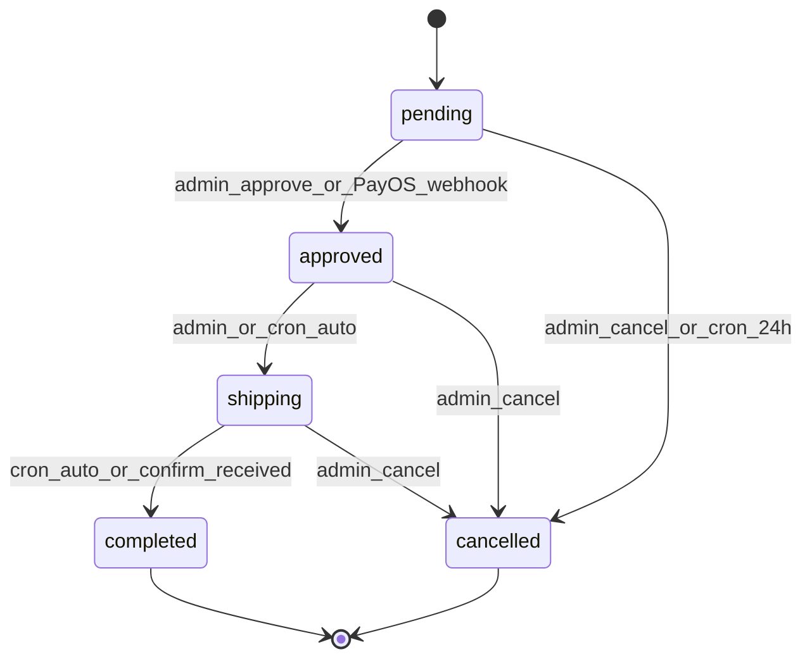

---

## D7 — JWT authentication flow (Appendix A1)

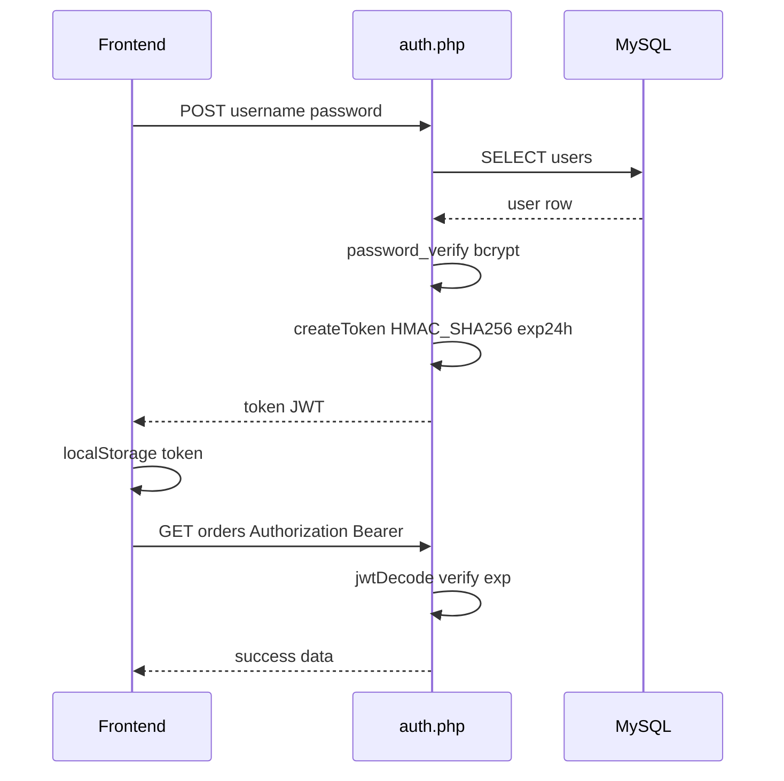

---

## D8 — AI Chatbot flow (Slide 30)

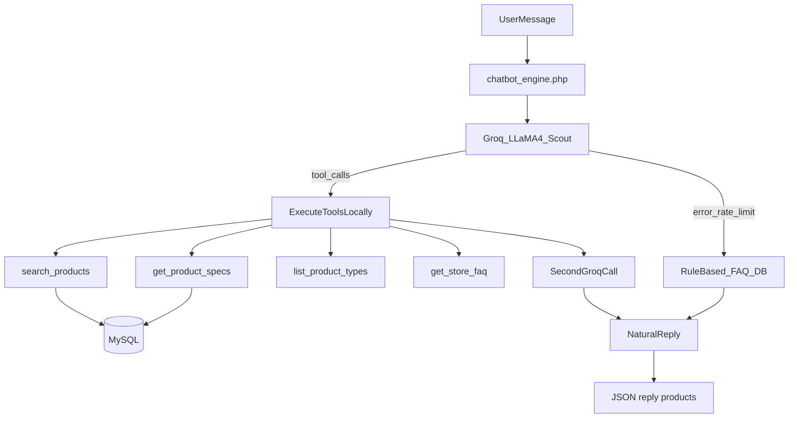

---

## D9 — ERD rút gọn (Slide 16)

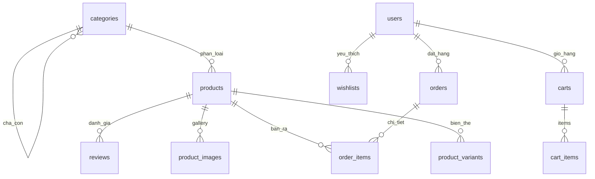

---

## D10 — RBAC 3 cấp (Slide 29)

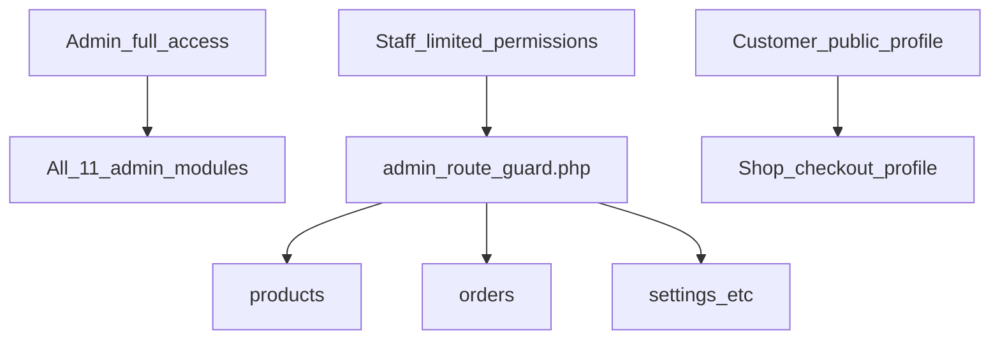

---

## D11 — Bảo mật 7 lớp (Slide 19)

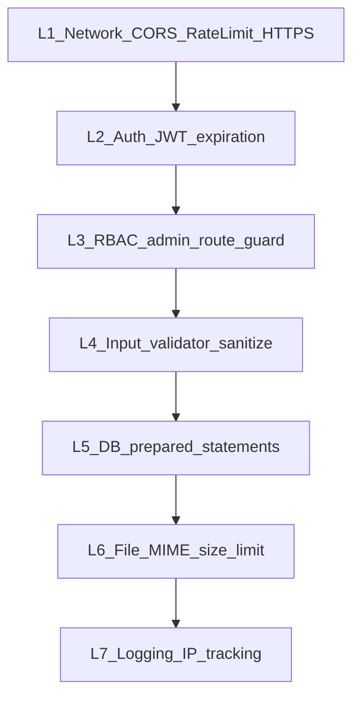

---

## D12 — Use case tổng quan (Slide 10)

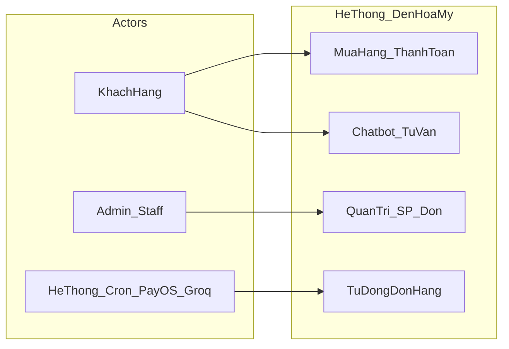

---

## D13 — Giải pháp đề xuất — luồng hệ thống (Slide 9+)

> Dùng cho slide **GIẢI PHÁP ĐỀ XUẤT** (cột phải). Export PNG dọc, tông vàng/đen/trắng.

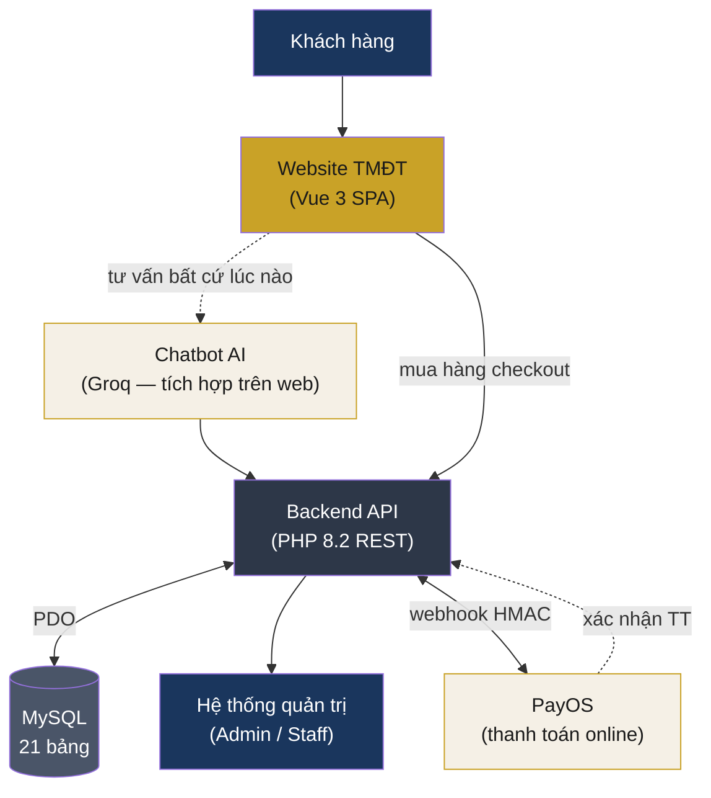

**Phiên bản rút gọn** (nếu slide chật, chỉ 4 box dọc):

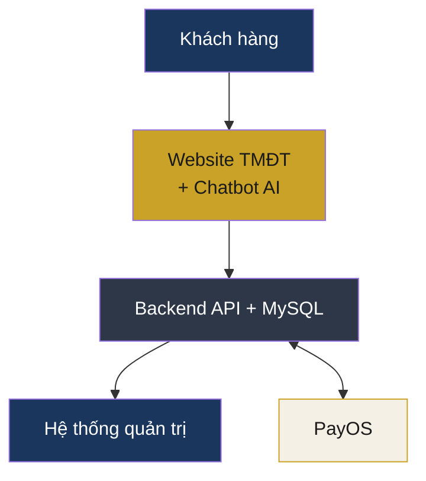
