# Sơ đồ cho Slide — Đèn Hoa Mỹ

> Export: dán Mermaid vào [mermaid.live](https://mermaid.live) hoặc draw.io, xuất PNG/SVG cho PowerPoint.  
> Gắn vào slide theo cột **Slide** bên dưới.

---

## D1 — Kiến trúc 3-tier (Slide 13)

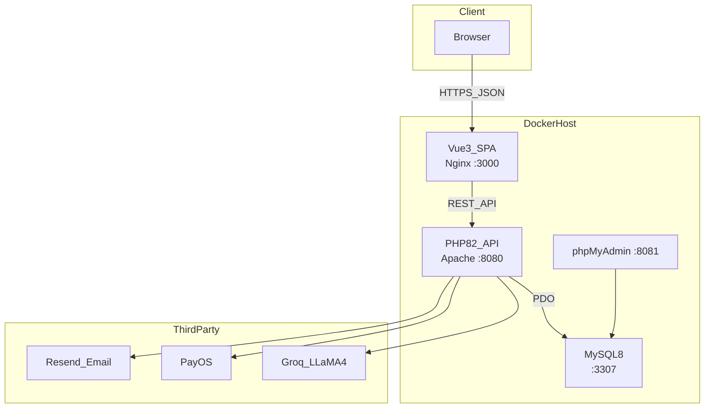

---

## D2 — Docker Compose services (Slide 14)

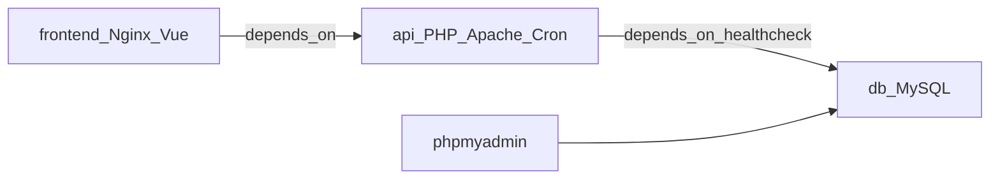

---

## D3 — Request lifecycle Backend (Slide 18)

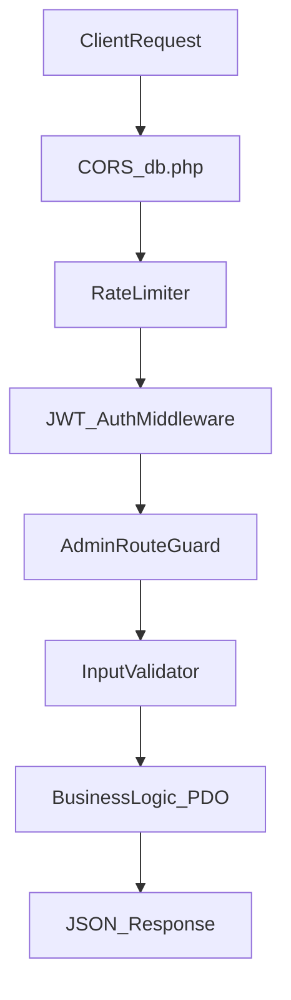

---

## D4 — Giỏ hàng & đồng bộ (Slide 23)

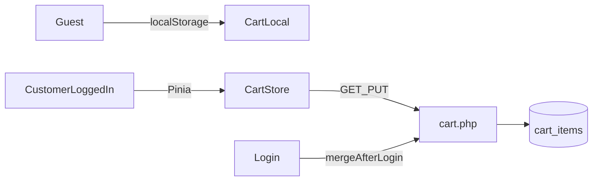

---

## D5 — Luồng đặt hàng & PayOS (Slide 24–25)

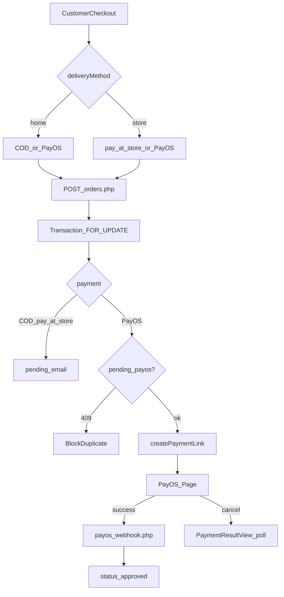

---

## D6 — Order status machine (Slide 27)

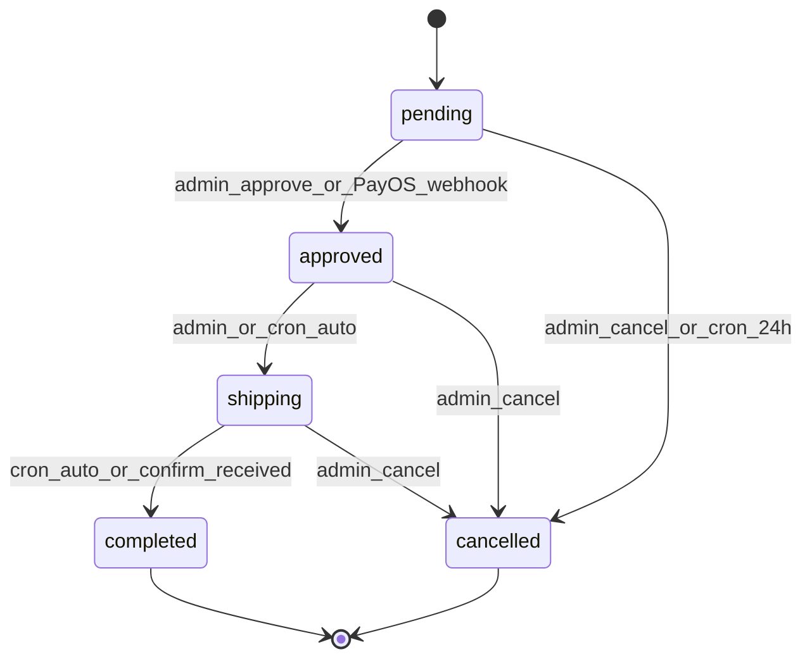

---

## D7 — JWT authentication flow (Appendix A1)

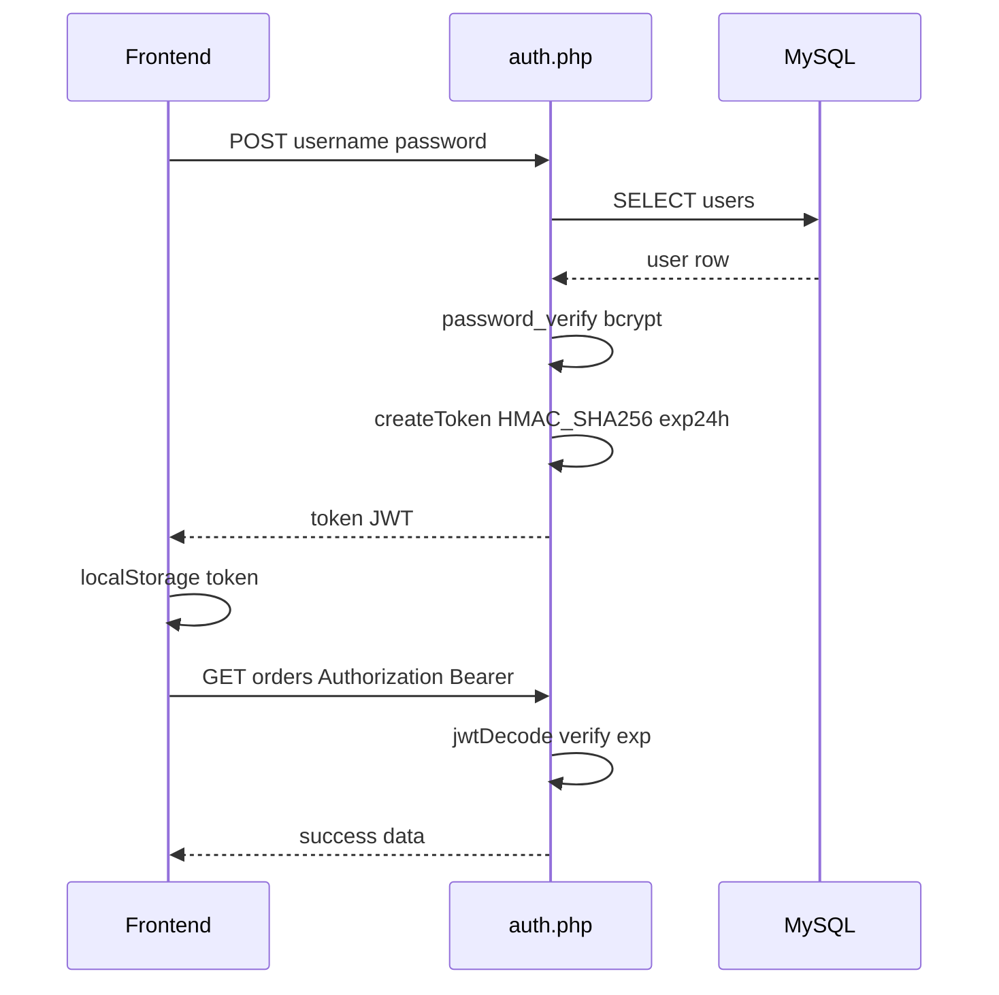

---

## D8 — AI Chatbot flow (Slide 30)

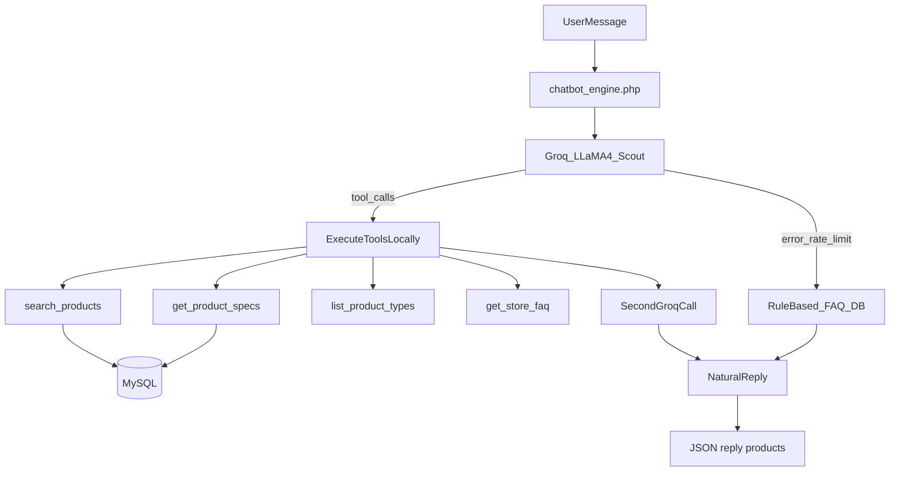

---

## D9 — ERD rút gọn (Slide 16)

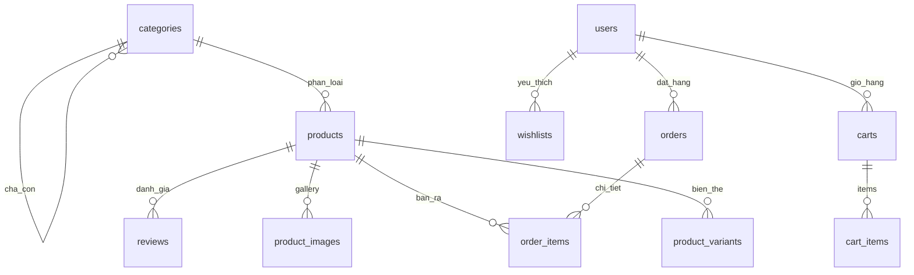

---

## D10 — RBAC 3 cấp (Slide 29)

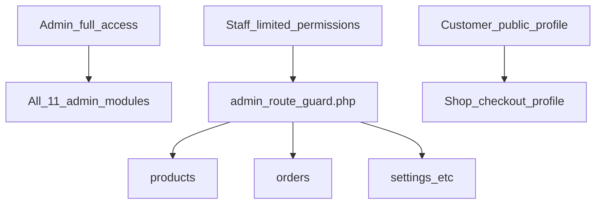

---

## D11 — Bảo mật 7 lớp (Slide 19)

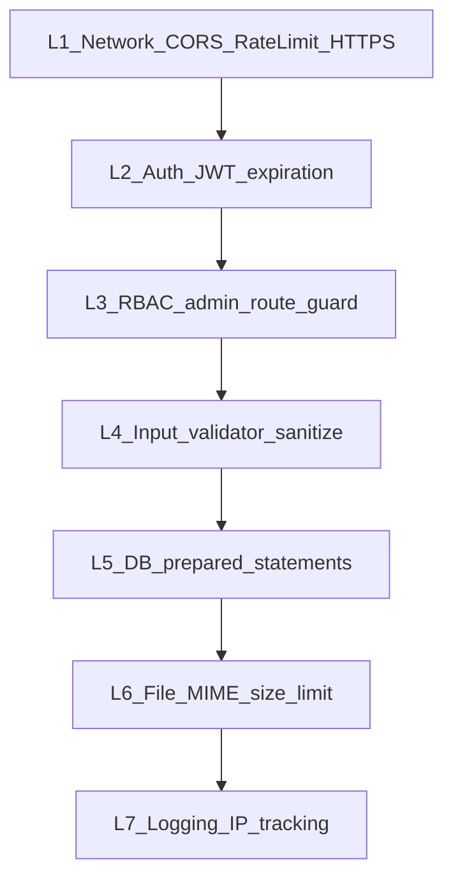

---

## D12 — Use case tổng quan (Slide 10)

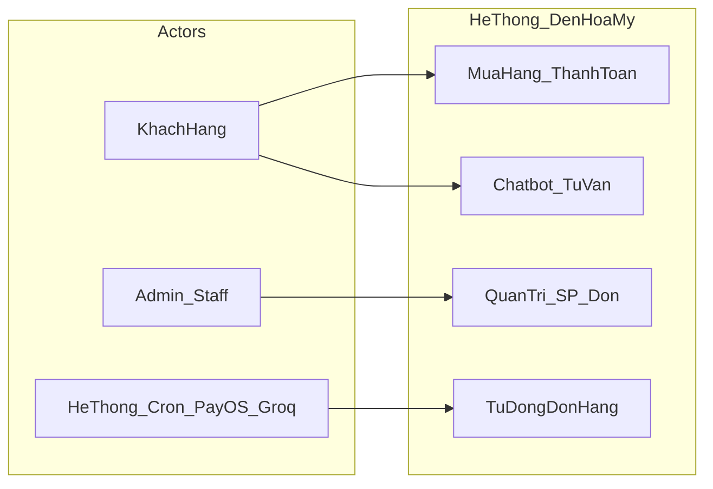
