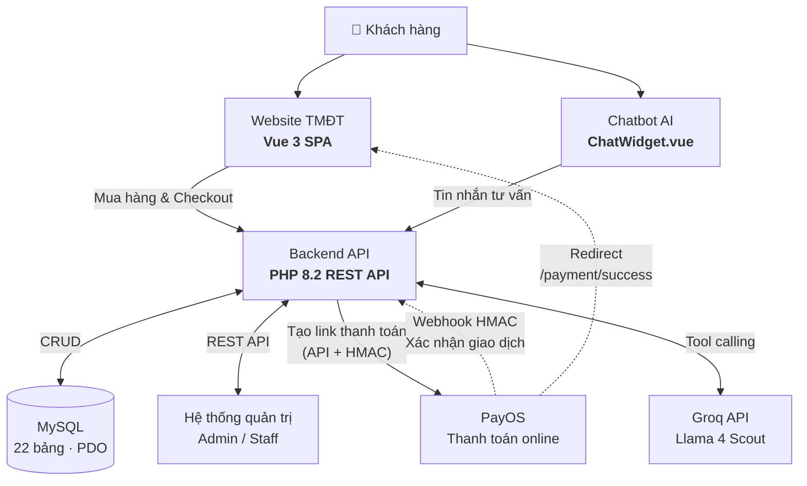

# Sơ đồ luồng hệ thống — Đèn Hoa Mỹ (bản chuẩn)

> Dùng cho slide bảo vệ. Đã chỉnh theo code thực tế (PayOS webhook, Chatbot qua Backend, Groq).

---

## 1. Sơ đồ ASCII (copy layout vào PowerPoint / Canva)

```
                         ┌─────────────────────┐
                         │     KHÁCH HÀNG      │
                         └──────────┬──────────┘
                                    │
              ┌─────────────────────┴─────────────────────┐
              │                                           │
              ▼                                           ▼
   ┌──────────────────────┐                 ┌──────────────────────┐
   │   WEBSITE TMĐT       │                 │   CHATBOT AI         │
   │   Vue 3 SPA          │                 │   ChatWidget.vue     │
   │   (Trang bán hàng)   │                 │   Tư vấn 24/7        │
   └──────────┬───────────┘                 └──────────┬───────────┘
              │                                          │
              │ Mua hàng & Checkout                      │ Gửi tin nhắn
              │                                          │
              └──────────────────┬───────────────────────┘
                                 │
                                 ▼
                    ┌────────────────────────┐
                    │      BACKEND API       │
                    │   PHP 8.2 REST API     │
                    │ orders, products,      │
                    │ chatbot_engine, ...    │
                    └────────────┬───────────┘
                                 │
         ┌───────────────────────┼───────────────────────┐
         │                       │                       │
         ▼                       ▼                       ▼
┌─────────────────┐   ┌─────────────────────┐   ┌─────────────────┐
│     MySQL       │   │ Hệ thống quản trị   │   │   Groq API      │
│  22 bảng (PDO)  │   │ Admin / Staff       │   │ Llama 4 Scout   │
└─────────────────┘   │ (Vue /admin)        │   └────────▲────────┘
                      └──────────┬──────────┘            │
                                 │              Tool calling + chat
                                 │                       │
                                 ▼                       │
                      ┌─────────────────────┐            │
                      │       PayOS         │            │
                      │  Thanh toán online  │            │
                      └──────────┬──────────┘            │
                                 │                       │
              Tạo link thanh toán│                       │
              (API + HMAC)       │                       │
                      ┌──────────┘                       │
                      │                                  │
         Webhook HMAC │  Redirect trình duyệt            │
         (server→server)  /payment/success              │
                      │                                  │
                      └──────────► Backend ◄─────────────┘
                                    │
                                    └──► MySQL (cập nhật đơn)
```

---

## 2. Mermaid (render trong GitHub / VS Code / mermaid.live)



---

## 3. Nhãn mũi tên PayOS (đã sửa so với bản cũ)

| Hướng | Nhãn đúng | Giải thích ngắn |
|-------|-----------|-----------------|
| **Backend → PayOS** | `Tạo link thanh toán (API + HMAC)` | `orders.php` gọi `createPaymentLink()` |
| **PayOS → Backend** | `Webhook HMAC — xác nhận giao dịch` | PayOS POST `payos_webhook.php` |
| **PayOS → Website** *(nét đứt, tuỳ chọn)* | `Redirect /payment/success` | Trình duyệt khách — UX, không thay webhook |

---

## 4. So sánh bản cũ vs bản mới

| Bản cũ | Bản mới |
|--------|---------|
| Backend → PayOS ghi **Webhook HMAC** | Webhook là **PayOS → Backend** |
| Groq nằm trong box Chatbot | **Backend** gọi Groq (bảo mật API key) |
| Chưa có redirect về website | Thêm nhánh **PayOS → Website** (tuỳ chọn) |
| MySQL 21 bảng | **22 bảng** |

---

## 5. Gợi ý màu slide (giữ style vàng–xanh như bản cũ)

| Box | Màu gợi ý |
|-----|-----------|
| Khách hàng | Be nhạt `#F5F0E6` |
| Website / Chatbot | Be `#F5F0E6`, viền vàng `#C9A227` |
| Backend API | Xanh đậm `#1A2744`, chữ trắng |
| MySQL / Admin / Groq / PayOS | Be `#F5F0E6`, viền vàng |
| Mũi tên webhook / redirect | **Nét đứt** |
| Mũi tên API thường | **Nét liền** |

---

## 6. Tài liệu liên quan

Chi tiết CSDL, map Vue/JS/PHP/DB và Q&A hội đồng → [CO_SO_DU_LIEU_VA_KET_NOI.md](./CO_SO_DU_LIEU_VA_KET_NOI.md)
